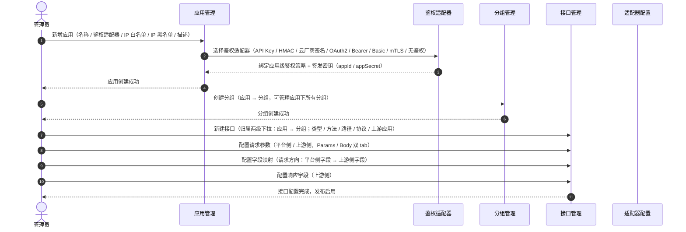
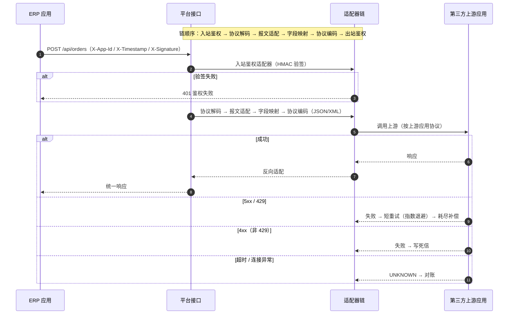
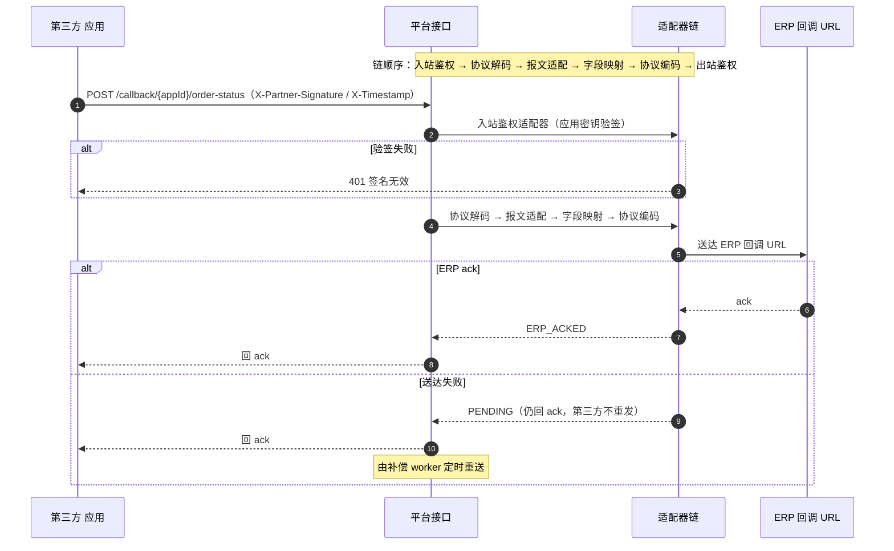
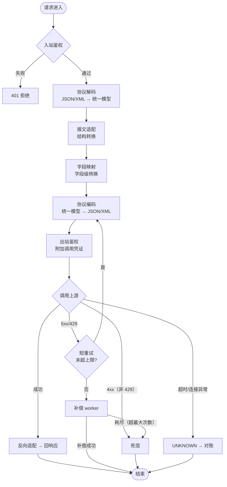

# API 中心 · 时序图与流程图

> 配合《API中心设计方案.md》，用 Mermaid 描述配置流程、两条链路（出站 Flow A / 入站 Flow B）时序，以及请求处理 + 容错流程图。

## 一、配置流程时序图（新增应用 → 接口配置）

> 鉴权适配器为「应用级默认 + 接口级覆盖」；接口归属经两级下拉（应用 → 分组）选择；协议适配器按入站/出站协议自动推导；字段映射在接口级配置（平台侧字段 → 上游侧字段）。

## 二、出站时序图（Flow A：ERP → 平台 → 第三方）

## 三、入站时序图（Flow B：第三方 → 平台 → ERP）

## 四、请求处理与容错流程图

