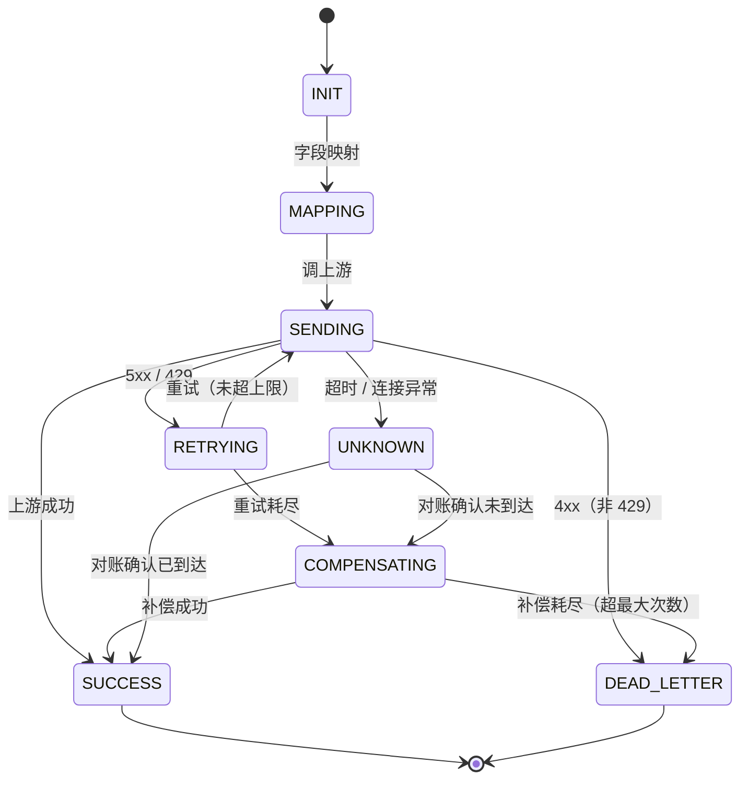
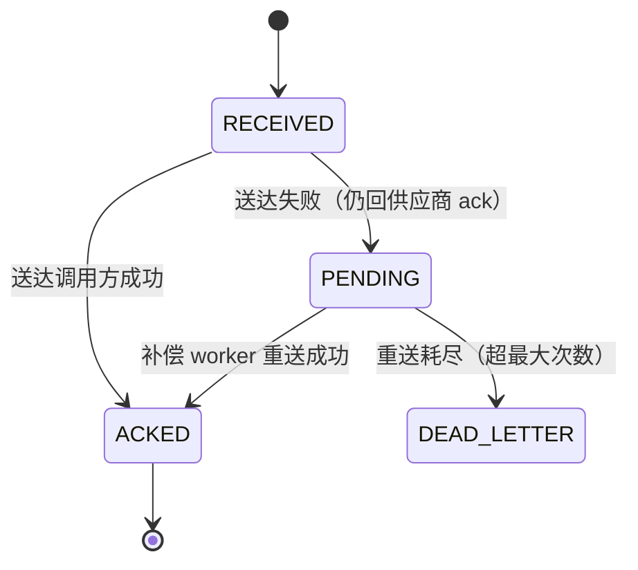

# API 中心 · 重新设计方案

> 5 个功能模块即顶层：应用管理、分组管理、接口管理、接口监控、适配器。定位为基础 API 中转 + 字段映射，支持 JSON 与 XML 协议。适配器整合鉴权、协议、报文三类，字段映射为接口级配置，按适配器链编排。可靠性、可观测等横切能力归入相关模块；第 6 章为状态机 / 错误码 / 容错机制附录。

## 1. 应用管理

### 1.1 应用模型与生命周期
- 应用 = 平台对接的一方供应商（第三方上游，如腾讯云 / 阿里云 / 智慧芽），持有 appId/appSecret；平台代理调用该供应商的接口。
- 供应商即上游：接口归属某供应商，也转发到该供应商，二者合一，不再区分「归属应用」与「上游应用」。
- 核心字段：appId（全局唯一）、应用名称、联系人、创建/更新时间。
- IP 白名单 / 黑名单：来源 IP 控制（多个 IP 用英文逗号分隔，为空时不限制请求 IP）。
- 服务地址（base-url）：平台调用该供应商时的目标地址（供应商 API 根地址，如 https://cvm.tencentcloudapi.com）。
- OAuth2 的 token URL / 授权回调地址属鉴权适配器配置（见 5.8 适配器配置元数据），不在应用级字段内。
- 生命周期状态机：草稿 → 启用 → 停用 → 注销；停用即拒绝其请求，注销后回收 appId。

### 1.2 应用凭证（出站签名 / 回调验签两类）
- 每应用持有一对 appId + appSecret，并按鉴权方向拆成两类凭证：
  - 出站凭证（平台作为调用方签名用）：appSecret / 云厂商 secretId+secretKey / OAuth2 clientSecret / Bearer token 等。
  - 回调验签凭证（平台验证供应商回调签名用，仅入站回调接口）：回调 HMAC secret / 云厂商回调 token 等，独立于出站凭证。
- 两类凭证均加密存储（可逆加密或 KMS/HSM），不落明文；不得单向哈希——签名/验签都需用明文密钥重算。
- 两类凭证均支持轮换（新旧短暂并存，平滑切换）、重置与即时失效。

### 1.3 应用接入流程
- 创建应用（填资料）→ 签发密钥 → 启用。
- 支持自助创建、无需审批，全程留痕（谁创建、何时、改了什么）。
- 分组与接口分别在「分组管理」「接口管理」中配置。

### 1.4 应用级配置（限流 / 配额 / 黑白名单）
- 每应用配额：QPS 限流、日调用量上限。
- 黑白名单：来源 IP / 调用范围控制。
- 超限处理：限流拒绝 + 告警，不污染业务状态机。
- 应用级默认 = 出站鉴权 + 回调验签 + 默认报文适配器；接口可覆盖（详见 5.7）。

## 2. 分组管理

### 2.1 分组模型
- 分组是应用下的组织单元，纯归类/展示用，不承载配置。
- 层级：应用 → 分组 → 接口；接口归属唯一应用，经分组归入。
- 分组字段：分组标识、名称、所属应用、排序。

### 2.2 分组管理功能
- 跨应用查看/管理所有分组（按应用组织的两级视图）。
- 支持分组增删改查、接口在分组间移动。
- 分组下可查看其接口列表，点击进入接口详情。

### 2.3 接口归属（两级下拉）
- 新建接口时「归属」为两级下拉：先选应用，再选该应用下的分组。
- 接口创建后即归属该应用的分组（父子关系）。

## 3. 接口管理

### 3.1 接口定义模型（类型 / 方法 / 协议 / 应用 / 鉴权）
- 接口 = 平台对外暴露/代理的一个 API 定义。
- 核心字段：接口标识、接口类型（出站中转 / 入站回调）、HTTP 方法、平台侧路径（如 /api/orders、/callback/{appId}/instance-state）、应用（供应商，appId，既是归属也是上游）+ 目标地址（出站 = 上游路径 path；入站 = 回调地址 deliveryUrl）、描述。
- 归属：接口属于某应用下的某分组（应用 → 分组 → 接口），新建时经两级下拉选择。
- 鉴权：出站中转接口只配「供应商签名」（出站鉴权，应用级默认 + 接口级覆盖）；入站回调接口只配「回调验签」（入站鉴权，应用级默认 + 接口级覆盖）；调用方鉴权 / 向回调地址签名由平台统一处理，不在接口模型内。
- 协议（入站 / 出站各一，JSON/XML）：入站协议 = 来源→平台的报文格式，出站协议 = 平台→目标的报文格式，二者可不同；组合即 json-json / json-xml / xml-xml / xml-json 四种场景，协议适配器按协议自动推导，默认「出入站一致」。
- 请求参数：分「入站侧（来源→平台）」与「出站侧（平台→目标）」两侧；每侧 Params（参数名 / 类型 / 必填 / 示例值）与 Body（none / form-data / x-www-form-urlencoded / json / xml）两个 tab（入站回调的「出站侧」= 送达报文，必填）。
- 字段映射（入站 → 出站）：每条 = 入站字段(source) + 操作 + 出站字段(target) + 空值策略，source/target 从两侧参数下拉选择。
- 响应 / ack：出站 = 出站响应字段（出站方返回的字段列表）；入站 = ack 字段（平台回供应商的回执结构，固定 code/message，收到即回、与送达结果解耦，不回传调用方 ack）；平台侧响应为统一信封 `{code, msg, data}`，不逐接口配置。

### 3.2 接口归属与适配器链
- 接口归属唯一应用（经分组），父子关系，不再多对多授权。
- 接口可绑定鉴权与报文适配器，未绑定时继承应用默认；协议适配器按接口入站 / 出站协议自动推导；字段映射为接口级配置（见 3.1 / 5.6）。

### 3.3 接口级配置（超时 / 重试）
- 读超时（默认 3000ms）：出站 = 调上游超时；入站 = 回调地址调用超时。
- 重试策略：最大重试次数、退避、重试条件（5xx/429）。

### 3.4 接口生命周期（草稿 / 发布 / 下线 / 版本）
- 草稿 → 发布 → 下线。
- 版本化：接口配置变更生成新版本，支持回滚、灰度。
- 下线后停止路由。

### 3.5 接口调用链路（出站 Flow A / 入站 Flow B）
- Flow A 出站：调用方 → 平台接口 → 适配器链 → 调供应商 → 反向适配 → 回调用方。
- Flow B 入站：供应商回调 → 平台接口 → 适配器链 → 送达调用方 → ack。
- 状态机载体：出站为出站请求记录状态，入站为送达记录状态。

### 3.6 接口级容错（熔断 / 重试 / 补偿 / 死信 / 对账）
- 熔断：上游持续失败时快速失败，跳过重试直接进补偿 / 死信（详见 6.4）。
- 5xx/429 短重试 → 耗尽补偿。
- 4xx 死信。
- 超时 → UNKNOWN 对账。
- 补偿 worker 定时扫描。

## 4. 接口监控

### 4.1 调用日志（请求 / 响应 / traceId / 脱敏）
- AOP 拦截记录每次调用的请求/响应/耗时/结果。
- traceId 贯穿全链路。
- 敏感字段脱敏（手机号、密钥、Header 敏感值）。

### 4.2 成功率与延迟指标
- Micrometer/Prometheus 指标：调用量、成功率、P50/P95/P99 延迟。
- 按接口、应用（供应商）维度聚合。

### 4.3 链路追踪
- OpenTelemetry 集成，span 贯穿平台→上游。
- 可定位到具体节点耗时与失败。

### 4.4 告警策略
- 阈值告警：成功率下降、延迟超限、死信堆积、补偿失败。
- 通知渠道（邮件 / IM）。

### 4.5 失败诊断与对账查询
- UNKNOWN 状态对账查询。
- 失败请求快速定位（按 traceId / orderId）。
- 死信查看与重放。

## 5. 适配器

### 5.1 适配器体系总览
- 三类适配器：鉴权、协议、报文；字段映射为接口级配置（见 5.6），作为链上固定步骤而非全局适配器。
- 统一适配器接口，可插拔、可扩展。
- 适配器链：请求按固定顺序流过「入站鉴权（验来源：调用方 / 供应商回调）→ 协议解码 → 报文适配 → 字段映射 → 协议编码 → 出站鉴权（向供应商 / 回调地址附加凭证）」；其中调用方鉴权与向回调地址签名由平台统一处理，不在接口模型内。
- 以「统一内部模型」为链内唯一数据载体（格式无关）。
- 四种端到端转换场景（由整条链协作完成）：json-json / json-xml / xml-xml / xml-json（入站协议与出站协议各一、可不同，如 json-xml）。
- 鉴权 / 报文适配器绑定到接口 / 应用，未绑定用平台默认；协议适配器按接口协议自动推导，不参与绑定。

### 5.2 基适配器设计
- 顶层基适配器（Adapter）：所有适配器的统一契约（接口），三类适配器均实现它。核心方法：
  - `AdapterType type()`：标识三类（鉴权 / 协议 / 报文）。
  - `int order()`：链内执行顺序。
  - `boolean supports(AdapterContext ctx)`：是否适用于当前请求。
  - `AdapterContext process(AdapterContext ctx)`：执行并返回（可能已变更的）上下文。
  - 适配器无状态、配置驱动，链上复用。
- 链上下文（AdapterContext）：适配器链中传递的唯一上下文，携带：
  - 统一内部模型（payload，格式无关）。
  - 元数据：接口标识、应用标识（供应商）、输入/输出协议类型、traceId。
  - 鉴权结果（appId、是否通过）。
  - 错误 / 告警收集（各适配器可追加）。
  - 作用：解耦上下游，新增适配器只读写上下文。
- 鉴权基适配器（AuthAdapter）：双向契约——`AuthResult authenticate(RequestContext req)`（入站：验证来源——调用方或供应商回调，输入原始请求 Header / 参数 / 时间戳 / 报文摘要，输出通过 / 拒绝 + appId）+ `void applyCredential(OutboundRequest out)`（出站：作为调用方向对端附加凭证，如签名 / token / 证书）。具体实现：ApiKeyAuthAdapter、HmacAuthAdapter、CloudSignatureAdapter、CloudCallbackSignatureAdapter、OAuth2ClientCredentialsAdapter、OAuth2AuthorizationCodeAdapter、BearerTokenAuthAdapter、BasicAuthAdapter、MtlsAuthAdapter、NoopAuthAdapter。
- 协议基适配器（ProtocolAdapter）：契约（双向）`UnifiedModel decode(bytes, format)` / `bytes encode(UnifiedModel, format)`，是「格式」的唯一责任方。具体实现：JsonProtocolAdapter、XmlProtocolAdapter。
- 报文基适配器（MessageAdapter）：契约 `UnifiedModel adapt(UnifiedModel)`，做报文结构转换（信封/包裹、报文头、请求/响应结构）。具体实现按应用定制（EnvelopeMessageAdapter、HeaderMappingAdapter 等）。
- 字段映射（接口级配置，链上固定步骤）：做字段级转换，格式无关，规则在接口级配置（见 5.6 / 3.1），不作为全局适配器实例；json-json / json-xml / xml-xml / xml-json 四种组合由「协议适配器 + 字段映射」协作完成。

### 5.3 鉴权适配器
- 可插拔鉴权策略（按需选用，每个策略均含「入站验证 authenticate」与「出站签名 applyCredential」两个方向，按接口/应用分别绑定）：
  - API Key（静态密钥：Header 名 + API Key 值）
  - HMAC 签名（简单 HMAC：签名算法 / 签名头 / 时间戳容差 / 防重放）
  - 云厂商签名（腾讯云 TC3 / AWS SigV4 / 阿里云 ACS3：SecretId / SecretKey / 服务名 / 地域 / 签名头）
  - 云厂商回调验签（腾讯云事件通知 / AWS SNS / 阿里云回调签名：回调 token / 证书验签）——入站方向专用
  - OAuth 2.0 Client Credentials（机器对机器：Token 端点 / Client ID / Client Secret / Scope）
  - OAuth 2.0 授权码（授权地址 / Token 端点 / Client ID / Client Secret / 回调地址 / Scope）
  - Bearer Token（静态 token：Token / Header 名 / 前缀）
  - Basic Auth（HTTP 基础认证，仅限 HTTPS）
  - mTLS（双向证书：客户端证书 / 私钥 / CA 证书 / 校验方式）
  - 无鉴权（内网 / 演示）
- 回调验签（供应商 → 平台，仅入站回调接口）：
  - 用「回调验签凭证」验签（HMAC 回调 / 云厂商回调验签），独立于出站签名凭证。
  - 失败返回 401；连续失败告警 / 临时封禁（防暴力破解）。
  - 调用方鉴权（平台自己的客户，如 ERP）由平台统一处理，不在本模型内。
- 出站鉴权（平台作为调用方，向目标证明身份）：
  - 出站中转：按供应商要求附加凭证（API Key header / 云厂商签名 / Bearer Token / OAuth2 client_credentials / mTLS 客户端证书）。
  - 入站回调：向回调地址附加凭证（可选，默认无）。
- 密钥管理：出站 / 入站两类凭证均加密存储、轮换（新旧并存）、泄漏即时失效。
- 绑定关系：出站鉴权与回调验签各为「应用级默认 + 接口级覆盖」两个独立绑定；回调验签仅对入站回调接口生效。

### 5.4 协议适配器（JSON / XML 编解码）
- 接口声明协议（JSON/XML）→ 协议适配器实现对应编解码。
- 每应用独立 ObjectMapper / XmlMapper，避免互相污染。
- JSON 编解码：命名策略、日期格式、忽略未知字段、空值策略、数字精度。
- XML 编解码：根元素、命名空间、属性 vs 元素映射。
- 解析失败容错：明确错误码 + 落日志，不污染状态机。

### 5.5 报文适配器（输入 / 输出报文转换）
- 管「外壳/骨架」：输入报文 → 统一内部模型；统一内部模型 → 输出报文。
- 报文结构转换：信封/包裹、报文头处理。
- 响应信封映射：剥上游信封（`envelope`，如 `data`）+ 读上游状态码（`codeField`/`successValue`）判断成败 + 错误码映射（`codeMappings`）+ 包平台统一信封 `{code, msg, data}`（`msg` 透传上游 `messageField`）。
- 入站回调 ack：平台回供应商的「回执」结构可配置（ack 字段列表，固定 code/message）；收到回调即回，与送达结果解耦（送达失败仍回 ack，供应商不重发）。
- 分工边界：报文适配器管报文整体结构与状态码，字段映射（接口级）管字段内容。

### 5.6 字段映射（接口级配置）
- 字段映射在「接口级」配置，不再作为全局适配器：每条规则 = 入站字段(source) + 操作 + 出站字段(target) + 操作参数(param，可选) + 空值策略，source/target 从接口的两侧请求参数下拉选择；枚举映射 / 默认值 / 条件 / 聚合 / 类型转换等参数化操作需填 param。
- 方向明确为「入站 → 出站」；响应方向的反向映射暂不建模（入站回调的 ack 是「回执」而非响应回显，故无需反向映射，送达结果只落内部状态）。
- 扩展方向：响应方向字段映射（供应商字段 → 平台字段）已列入《开发计划.md》§1.1「扩展候选」（未排期），需求明确后另行设计评审。
- 操作：重命名（rename）、类型转换（typeCast）、枚举映射（enumMap）、默认值（default）、条件（condition）、聚合（aggregate）。
- 字段级转换：重命名、类型转换、枚举映射、默认值 / 常量注入、条件与空值策略。

### 5.7 适配器链编排与绑定
- 链顺序：入站鉴权 → 协议解码 → 报文适配 → 字段映射 → 协议编码 → 出站鉴权。
- 鉴权 / 报文适配器绑定到接口 / 应用，可插拔、可覆盖，未绑定继承默认；协议适配器按协议自动推导。
- 元数据驱动，新增适配器不影响既有链路。
- 适配器可配置化、版本化、灰度切换。

### 5.8 适配器配置元数据（字段结构）

适配器「无状态、配置驱动」——配置元数据即适配器运行时读取的全部参数。每类适配器配置均含统一外层字段 + 各自 `params`：

- 统一外层：`adapterType`（auth / protocol / message）、`impl`（具体实现类）、`enabled`（启用 / 停用）、`version`（版本，用于版本化 / 灰度）、`params`（该类适配器的具体参数，见下表）。

| 适配器 | params 关键字段 | 说明 |
|---|---|---|
| 鉴权 · API Key | `apiKey`、`headerName` | API Key 值（遮显）、携带密钥的 Header 名（X-API-Key / X-App-Id / X-Auth-Token / api-key） |
| 鉴权 · HMAC | `signatureAlgorithm`、`signatureHeader`、`timestampToleranceSeconds`、`replayProtection` | 签名算法（HMAC-SHA256/SHA1/SHA512）、签名头名、时间戳容差（300s）、是否防重放 |
| 鉴权 · 云厂商签名 | `scheme`、`secretId`、`secretKey`、`service`、`region`、`signedHeaders` | 签名规范（TC3-HMAC-SHA256 / AWS4-HMAC-SHA256 / ACS3-HMAC-SHA256）、SecretId、SecretKey、服务名、地域、签名头 |
| 鉴权 · 云厂商回调验签 | `scheme`、`token`、`certificate` | 回调验签规范（腾讯云事件通知 / AWS SNS / 阿里云回调）、回调 token、验签证书（AWS SNS X509） |
| 鉴权 · OAuth2 Client Credentials | `tokenUrl`、`clientId`、`clientSecret`、`scope` | token 端点、Client ID、Client Secret、Scope |
| 鉴权 · OAuth2 授权码 | `authorizationUrl`、`tokenUrl`、`clientId`、`clientSecret`、`redirectUri`、`scope` | 授权地址、token 端点、Client ID、Client Secret、回调地址、Scope |
| 鉴权 · Bearer Token | `token`、`headerName`、`prefix` | Token（遮显）、Header 名（Authorization / X-Auth-Token / X-Access-Token）、前缀（Bearer / Token） |
| 鉴权 · Basic | `username`、`password` | 基础认证（仅限 HTTPS） |
| 鉴权 · mTLS | `clientCert`、`clientKey`、`caCert`、`verifyMode` | 客户端证书 / 私钥 / CA 证书（文件上传）、校验方式（STRICT / OPTIONAL / NONE） |
| 协议（protocol） | `format` | JSON / XML；协议适配器按接口入站 / 出站协议自动推导 |
| 协议 · JSON | `namingStrategy`、`dateFormat`、`ignoreUnknown`、`nullHandling`、`numberPrecision` | 命名策略、日期格式、忽略未知字段、空值策略、数字精度 |
| 协议 · XML | `rootElement`、`namespace`、`attrVsElement` | 根元素、命名空间、属性 vs 元素映射 |
| 报文 · 信封（EnvelopeMessageAdapter） | `envelope`、`codeField`、`successValue`、`codeMappings[]`、`messageField`、`defaultErrorCode` | 业务数据容器（data）、上游状态码字段、成功值、错误码映射、消息字段、兜底错误码 |
| 报文 · 报文头（HeaderMappingAdapter） | `headerMappings[]` | 报文头字段映射规则 |
| （字段映射为接口级配置） | 见 3.1 | 字段映射规则不再作为适配器参数，改为接口级 `fieldMappings` |

字段映射规则 `fieldMappings[]` 每条（接口级）：`source`（入站字段，`default` 常量注入时可空）、`op`（rename / typeCast / enumMap / default / condition / aggregate）、`target`（出站字段）、`param`（操作参数，如枚举映射表 `PENDING→0, DONE→1` / 默认值 / 条件表达式 / 聚合方式，仅参数化操作需要）、`nullStrategy`（保留原值 / 置空 / 默认值 / 报错）。

错误码映射 `codeMappings[]` 每条：`from`（上游错误码）、`to`（平台错误码）。

配置元数据与「统一内部模型」一一对应，持久化后按 `adapterType + impl + version` 索引；接口级配置覆盖应用级默认（呼应 5.7 与接口级容错）。

## 6. 状态机 / 错误码 / 容错机制

### 6.1 状态机

出站请求状态机（Flow A）：



- 状态流：`INIT → MAPPING → SENDING → RETRYING → COMPENSATING → SUCCESS / DEAD_LETTER / UNKNOWN`。
- 5xx/429 → RETRYING（短重试，指数退避，未超上限回 SENDING）；重试耗尽 → COMPENSATING（补偿 worker 兜底）。
- 补偿超过最大次数 → DEAD_LETTER（死信 + 告警）。
- 4xx（非 429）→ DEAD_LETTER，不重试。
- 超时 / 连接异常 → UNKNOWN（结果不确定），对账收敛为 SUCCESS 或 COMPENSATING。
- SENDING 前经熔断器闸门：OPEN 时直接转 COMPENSATING / DEAD_LETTER，不触发重试（详见 6.4）。

入站送达状态机（Flow B）：



- 状态流：`RECEIVED → ACKED / PENDING`。
- 送达失败 → PENDING（仍回供应商 ack，供应商不重发），由补偿 worker 重送至 ACKED。
- 重送超过最大次数 → DEAD_LETTER（死信 + 告警）。

### 6.2 统一错误码与响应规范

统一响应结构：

```json
{ "code": 0, "msg": "ok", "data": {} }
```

- `code = 0` 成功，非 0 失败；`msg` 人类可读信息；`data` 业务数据（失败时可为空）。

错误码分段：

| code 段 | 含义 | 示例 |
|---|---|---|
| 0 | 成功 | — |
| 401xx | 鉴权失败 | 40100 验签失败、40101 时间戳过期、40102 应用未启用 |
| 400xx | 参数 / 请求错误 | 40001 字段缺失、40002 报文格式非法 |
| 404xx | 资源不存在 | 40401 接口不存在、40402 应用不存在 |
| 429xx | 限流 / 配额 | 42901 QPS 限流、42902 日配额超限、42903 上游限流（透传上游 429） |
| 502xx | 上游错误 | 50201 上游 5xx |
| 504xx | 上游超时 | 50401 上游读超时 |
| 500xx | 平台内部错误 | 50000 未知异常 |

> 说明：上游返回 429 属限流语义，归入 429xx（42903）；502xx 仅表示上游 5xx（网关错误）。

### 6.3 对账 / 补偿机制

- 对账（UNKNOWN 处理）：UNKNOWN = 结果不确定（可能已达上游），不可盲目重试；通过查询接口查上游真实状态，已成功 → 收敛 SUCCESS，未到达 → 触发补偿 COMPENSATING。
- 补偿：补偿 worker 定时扫描出站 COMPENSATING 记录与入站 PENDING 记录，按固定间隔（如 3s）重试；超过最大次数（如 5 次）转死信 + 告警；补偿重放不重复生效依赖**上游对业务键幂等**（请求携带稳定 biz_id 由上游去重）。

### 6.4 熔断机制

- 目标：上游持续不可用时快速失败，避免反复重试压垮上游、占用线程与连接资源。
- 三态：`CLOSED（正常放行） → OPEN（快速失败） → HALF_OPEN（半开放行探测） → CLOSED / OPEN`。
- 参数：失败率阈值（如 50%）、滑动窗口 + 最小请求数（如 10s / 10 次）、熔断时长（如 30s）、半开探测请求数（如 1~2 次）。
- OPEN：直接快速失败，不触发 `@Retryable` 短重试，转 COMPENSATING / DEAD_LETTER。
- HALF_OPEN：放行少量探测请求；探测成功恢复 CLOSED，失败回到 OPEN 重新计时。
- 与重试 / 补偿的衔接：熔断先于短重试判断；熔断触发的失败同样落调用日志与告警，冷却结束后自动半开探测。
- 粒度：按「接口 + 供应商」为熔断维度，避免一个坏供应商拖垮所有接口。
