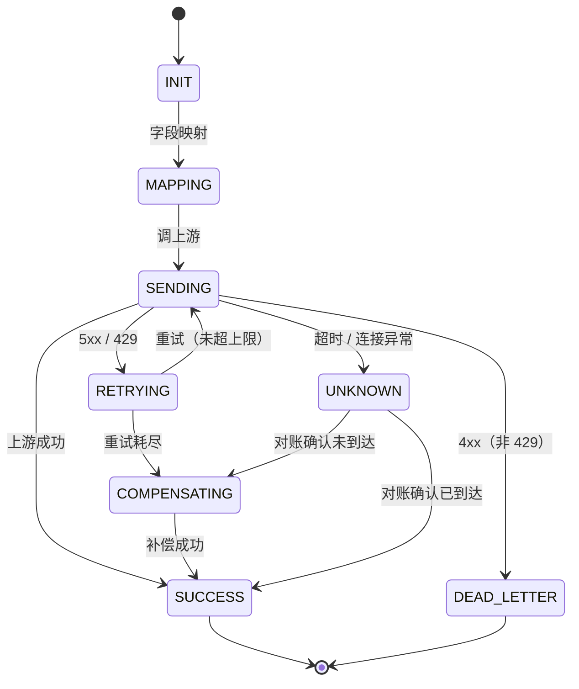
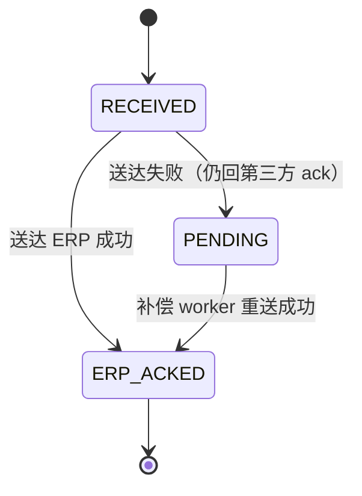

# API 中心 · 重新设计方案

> 5 个功能模块即顶层：应用管理、分组管理、接口管理、接口监控、适配器。定位为基础 API 中转 + 字段映射，支持 JSON 与 XML 协议。适配器整合鉴权、协议、报文、字段映射四类，按适配器链编排。可靠性、可观测等横切能力归入相关模块；第 6 章为状态机 / 错误码 / 容错机制附录。

## 1. 应用管理

### 1.1 应用模型与生命周期
- 应用 = 调用平台的一方主体（持有 appId/appSecret 并发起请求）：出站场景是 ERP，入站场景是第三方。
- 被代理的第三方上游属于「接口 / 渠道」概念，不在「应用」范畴。
- 核心字段：appId（全局唯一）、应用名称、类型（ERP / 第三方 / 内部）、联系人、创建/更新时间。
- 生命周期状态机：草稿 → 启用 → 停用 → 注销；停用即拒绝其请求，注销后回收 appId。

### 1.2 应用密钥与凭证
- 每应用持有一对 appId + appSecret。
- appSecret 加密存储，不落明文（存哈希或加密值）。
- 支持密钥轮换（新旧短暂并存，平滑切换），支持重置与即时失效。

### 1.3 应用接入流程
- 创建应用（填资料）→ 签发密钥 → 启用。
- 支持自助创建、无需审批，全程留痕（谁创建、何时、改了什么）。
- 分组与接口分别在「分组管理」「接口管理」中配置。

### 1.4 应用级配置（限流 / 配额 / 黑白名单）
- 每应用配额：QPS 限流、日调用量上限。
- 黑白名单：来源 IP / 调用范围控制。
- 超限处理：限流拒绝 + 告警，不污染业务状态机。
- 应用可设默认适配器链，接口可覆盖（详见 5.7 适配器链编排与绑定）。

## 2. 分组管理

### 2.1 分组模型
- 分组是应用下的组织单元，纯归类/展示用，不承载配置。
- 层级：应用 → 分组 → 接口；接口归属唯一应用，经分组归入。
- 分组字段：分组标识、名称、所属应用、排序。

### 2.2 分组管理功能
- 跨应用查看/管理所有分组（按应用组织的两级视图）。
- 支持分组增删改查、接口在分组间移动。
- 分组下可查看其接口列表，点击进入接口详情。

### 2.3 接口归属（两级下拉）
- 新建接口时「归属」为两级下拉：先选应用，再选该应用下的分组。
- 接口创建后即归属该应用的分组（父子关系）。

## 3. 接口管理

### 3.1 接口定义模型（路径 / 方法 / 协议 / 上游地址）
- 接口 = 平台对外暴露/代理的一个 API 定义。
- 核心字段：接口标识、HTTP 方法、平台侧路径（如 /api/orders、/callback/{channel}/order-status）、上游地址（base-url + path）、请求/响应模型。
- 归属：接口属于某应用下的某分组（应用 → 分组 → 接口），新建时经两级下拉选择。
- 协议类型（JSON/XML）：接口对外/对上游声明的格式契约，由协议适配器实现对应编解码。
- 接口类型：出站中转（ERP→第三方）vs 入站回调（第三方→ERP）。

### 3.2 接口归属与适配器链
- 接口归属唯一应用（经分组），父子关系，不再多对多授权。
- 接口可绑定适配器链（鉴权 / 协议 / 报文 / 字段映射），未绑定时继承应用默认。

### 3.3 接口级配置（超时 / 重试 / 幂等）
- 读超时（默认 3000ms）。
- 重试策略：最大重试次数、退避、重试条件（5xx/429）。
- 幂等开关：是否启用幂等键校验。

### 3.4 接口生命周期（草稿 / 发布 / 下线 / 版本）
- 草稿 → 发布 → 下线。
- 版本化：接口配置变更生成新版本，支持回滚、灰度。
- 下线后停止路由。

### 3.5 接口调用链路（出站 Flow A / 入站 Flow B）
- Flow A 出站：ERP → 平台接口 → 适配器链（鉴权 / 协议 / 报文 / 字段映射）→ 调上游 → 反向适配 → 回 ERP。
- Flow B 入站：上游回调 → 平台接口 → 适配器链 → 送达 ERP → ack。
- 状态机载体：出站为出站请求记录状态，入站为送达记录状态。

### 3.6 接口级容错（重试 / 补偿 / 死信 / 对账）
- 5xx/429 短重试 → 耗尽补偿。
- 4xx 死信。
- 超时 → UNKNOWN 对账。
- 补偿 worker 定时扫描。

## 4. 接口监控

### 4.1 调用日志（请求 / 响应 / traceId / 脱敏）
- AOP 拦截记录每次调用的请求/响应/耗时/结果。
- traceId 贯穿全链路。
- 敏感字段脱敏（手机号、密钥、Header 敏感值）。

### 4.2 成功率与延迟指标
- Micrometer/Prometheus 指标：调用量、成功率、P50/P95/P99 延迟。
- 按接口、应用、渠道维度聚合。

### 4.3 链路追踪
- OpenTelemetry 集成，span 贯穿平台→上游。
- 可定位到具体节点耗时与失败。

### 4.4 告警策略
- 阈值告警：成功率下降、延迟超限、死信堆积、补偿失败。
- 通知渠道（邮件 / IM）。

### 4.5 失败诊断与对账查询
- UNKNOWN 状态对账查询。
- 失败请求快速定位（按 traceId / orderId）。
- 死信查看与重放。

## 5. 适配器

### 5.1 适配器体系总览
- 四类适配器：鉴权、协议、报文、字段映射。
- 统一适配器接口，可插拔、可扩展。
- 适配器链：请求按固定顺序流过「鉴权 → 协议解码 → 报文适配 → 字段映射 → 协议编码」。
- 以「统一内部模型」为链内唯一数据载体（格式无关）。
- 四种端到端转换场景（由整条链协作完成）：json-json / json-xml / xml-xml / xml-json。
- 每类适配器绑定到接口 / 应用，未绑定用平台默认。

### 5.2 基适配器设计
- 顶层基适配器（Adapter）：所有适配器的统一契约（接口），四类适配器均实现它。核心方法：
  - `AdapterType type()`：标识四类（鉴权 / 协议 / 报文 / 字段映射）。
  - `int order()`：链内执行顺序。
  - `boolean supports(AdapterContext ctx)`：是否适用于当前请求。
  - `AdapterContext process(AdapterContext ctx)`：执行并返回（可能已变更的）上下文。
  - 适配器无状态、配置驱动，链上复用。
- 链上下文（AdapterContext）：适配器链中传递的唯一上下文，携带：
  - 统一内部模型（payload，格式无关）。
  - 元数据：接口标识、应用标识、渠道、输入/输出协议类型、traceId。
  - 鉴权结果（appId、是否通过）。
  - 错误 / 告警收集（各适配器可追加）。
  - 作用：解耦上下游，新增适配器只读写上下文。
- 鉴权基适配器（AuthAdapter）：契约 `AuthResult authenticate(RequestContext req)`。输入原始请求（Header、参数、时间戳、报文摘要），输出鉴权结果（通过 / 拒绝 + appId）。具体实现：ApiKeyAuthAdapter、HmacAuthAdapter、OAuth2AuthAdapter、BearerJwtAuthAdapter、BasicAuthAdapter、MtlsAuthAdapter、NoopAuthAdapter。
- 协议基适配器（ProtocolAdapter）：契约（双向）`UnifiedModel decode(bytes, format)` / `bytes encode(UnifiedModel, format)`，是「格式」的唯一责任方。具体实现：JsonProtocolAdapter、XmlProtocolAdapter。
- 报文基适配器（MessageAdapter）：契约 `UnifiedModel adapt(UnifiedModel)`，做报文结构转换（信封/包裹、报文头、请求/响应结构）。具体实现按渠道定制（EnvelopeMessageAdapter、HeaderMappingAdapter 等）。
- 字段映射基适配器（FieldMappingAdapter）：契约 `UnifiedModel map(UnifiedModel, MappingRule)`，做字段级转换，格式无关。具体实现：RuleFieldMappingAdapter（按映射规则集驱动）；json-json / json-xml / xml-xml / xml-json 四种组合由「协议适配器 + 字段映射」协作完成，非字段映射适配器自身变体。

### 5.3 鉴权适配器
- 可插拔鉴权策略（按需选用）：
  - API Key（AppKey + AppSecret 密钥对）
  - HMAC 签名（密钥签名，防篡改防重放）
  - OAuth 2.0（授权码 / Client Credentials 等模式）
  - Bearer Token / JWT（无状态令牌）
  - Basic Auth（HTTP 基础认证，仅限 HTTPS）
  - mTLS（双向证书，高安全场景）
  - 无鉴权（内网 / 演示）
- 出站（Flow A，ERP→平台）：HMAC-SHA256(appId + timestamp + orderId, appSecret)，时间戳容差 300s，防重放。
- 入站（Flow B，第三方→平台）：X-Partner-Signature + X-Timestamp，按渠道密钥验签。
- 失败返回 401；连续失败告警 / 临时封禁（防暴力破解）。
- 密钥管理：appSecret 加密存储、轮换（新旧并存）、泄漏即时失效。
- 绑定关系：应用级默认 + 接口级覆盖。

### 5.4 协议适配器（JSON / XML 编解码）
- 接口声明协议（JSON/XML）→ 协议适配器实现对应编解码。
- 每渠道独立 ObjectMapper / XmlMapper，避免互相污染。
- JSON 编解码：命名策略、日期格式、忽略未知字段、空值策略、数字精度。
- XML 编解码：根元素、命名空间、属性 vs 元素映射。
- 解析失败容错：明确错误码 + 落日志，不污染状态机。

### 5.5 报文适配器（输入 / 输出报文转换）
- 管「外壳/骨架」：输入报文 → 统一内部模型；统一内部模型 → 输出报文。
- 报文结构转换：信封/包裹、请求/响应结构适配、报文头处理。
- 分工边界：报文适配器管报文整体结构，字段映射适配器管字段内容。

### 5.6 字段映射适配器
- 管「字段内容」，工作在统一内部模型上，格式无关。
- 字段级转换：重命名、类型转换、枚举映射、默认值 / 常量注入、条件与空值策略。
- 嵌套与聚合映射：嵌套展开/拍平、列表映射、多字段聚合。

### 5.7 适配器链编排与绑定
- 链顺序：鉴权 → 协议解码 → 报文适配 → 字段映射 → 协议编码。
- 绑定到接口 / 应用，可插拔、可覆盖，未绑定继承默认。
- 元数据驱动，新增适配器不影响既有链路。
- 适配器可配置化、版本化、灰度切换。

## 6. 状态机 / 错误码 / 容错机制

### 6.1 状态机

出站请求状态机（Flow A）：



- 状态流：`INIT → MAPPING → SENDING → RETRYING → COMPENSATING → SUCCESS / DEAD_LETTER / UNKNOWN`。
- 5xx/429 → RETRYING（短重试，指数退避，未超上限回 SENDING）；重试耗尽 → COMPENSATING（补偿 worker 兜底）。
- 4xx（非 429）→ DEAD_LETTER，不重试。
- 超时 / 连接异常 → UNKNOWN（结果不确定），对账收敛为 SUCCESS 或 COMPENSATING。

入站送达状态机（Flow B）：



- 状态流：`RECEIVED → ERP_ACKED / PENDING`。
- 送达失败 → PENDING（仍回第三方 ack，第三方不重发），由补偿 worker 重送至 ERP_ACKED。

### 6.2 统一错误码与响应规范

统一响应结构：

```json
{ "code": 0, "msg": "ok", "data": {} }
```

- `code = 0` 成功，非 0 失败；`msg` 人类可读信息；`data` 业务数据（失败时可为空）。

错误码分段：

| code 段 | 含义 | 示例 |
|---|---|---|
| 0 | 成功 | — |
| 401xx | 鉴权失败 | 40100 验签失败、40101 时间戳过期、40102 应用未启用 |
| 400xx | 参数 / 请求错误 | 40001 字段缺失、40002 报文格式非法 |
| 404xx | 资源不存在 | 40401 接口不存在、40402 应用不存在 |
| 429xx | 限流 / 配额 | 42901 QPS 限流、42902 日配额超限 |
| 502xx | 上游错误 | 50201 上游 5xx、50202 上游 429 |
| 504xx | 上游超时 | 50401 上游读超时 |
| 500xx | 平台内部错误 | 50000 未知异常 |

### 6.3 幂等 / 对账 / 补偿机制

- 幂等：幂等键 = `(biz_type, channel_code, biz_id)`，如 `(order, PARTNER_A, 订单号)`。首次请求写入幂等键并记录结果，重复请求命中即返回首次结果（防重复下单 / 重复回调）；幂等键设过期时间（如 7 天）。
- 对账（UNKNOWN 处理）：UNKNOWN = 结果不确定（可能已达上游），不可盲目重试；通过查询接口查上游真实状态，已成功 → 收敛 SUCCESS，未到达 → 触发补偿 COMPENSATING。
- 补偿：补偿 worker 定时扫描出站 COMPENSATING 记录与入站 PENDING 记录，按固定间隔（如 3s）重试；超过最大次数（如 5 次）转死信 + 告警；补偿重放受幂等键保护，不会重复生效。
