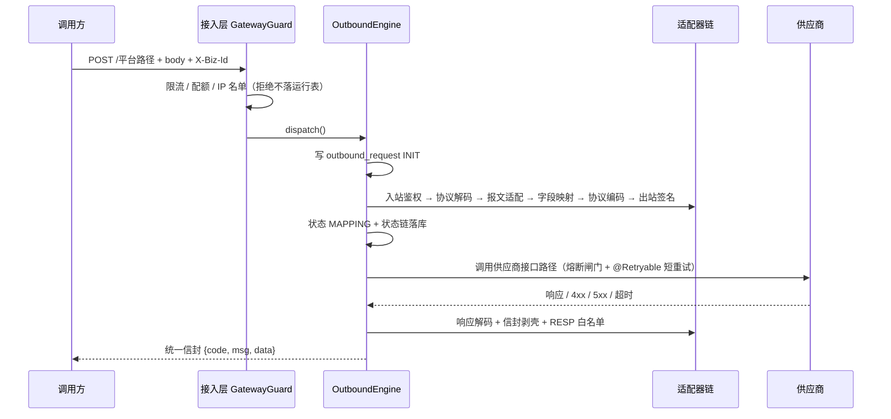
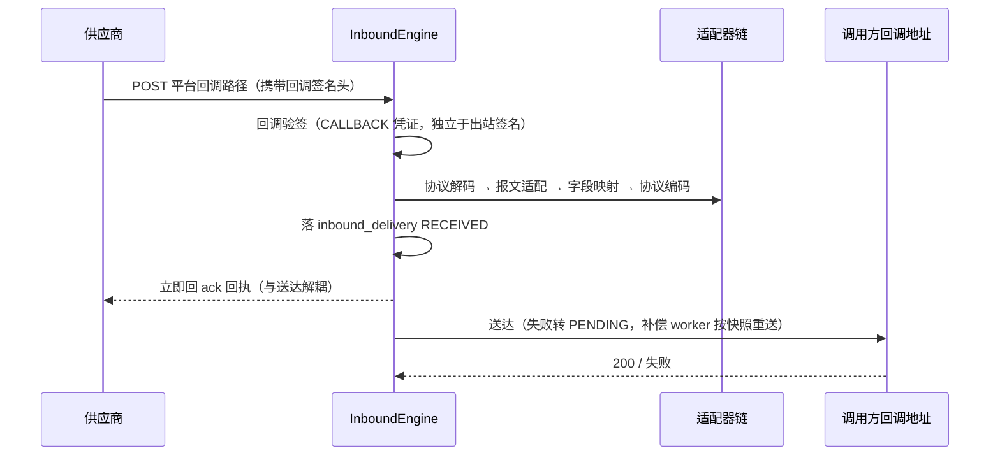

# apicenter · 项目说明文档

> 版本：v1.0（2026-09-09）｜ 适用代码基线：M0–M5 全部已落地（自动化测试 180 个 @Test）
> 配套文档：[《API中心使用教程》](API中心使用教程.md) ｜ [README](../../../../README.md) ｜ [整体测试方案](开发文档/整体测试方案.md)

---

## 1. 项目是什么

**apicenter = API 三方接口统一调用平台组件。**

它把「对接一家外部供应商接口」这件事从每个业务系统里抽出来，做成一个可配置、可复用、可观测的中转平台。业务系统只面向平台暴露的统一路径与统一报文，由平台负责：

- **连接**：把平台侧路径映射到供应商真实地址，组装凭证、发起调用。
- **适配**：协议（JSON / XML）编解码、报文结构（信封剥壳 / 回执）、字段级映射。
- **可靠传输**：重试、补偿、死信、对账、熔断、限流，保证「要么成功、要么可追溯」。

一句话定位：

> **只做连接 + 适配 + 可靠传输，不承接业务决策。**

平台**不做**的事（有意为之，避免与业务系统职责混淆）：

- 不做订单 / 商品等业务语义处理，不落业务明细；
- 不提供平台侧幂等开关（去重依赖供应商对业务键幂等，请求携带稳定 `biz_id`）；
- 不做调用方（平台客户）的业务鉴权与授权体系——调用方鉴权由平台统一按应用维度处理，不在接口模型内。

### 1.1 典型使用场景

| 场景 | 说明 |
|---|---|
| 多供应商统一接入 | 不同供应商的鉴权方式、报文格式各异，统一收口到平台配置，业务系统只认一种协议 |
| 出站中转（Flow A） | 业务系统 → 平台 → 供应商；平台做签名、编解码、字段映射与容错 |
| 入站回调（Flow B） | 供应商 → 平台 → 业务系统回调地址；平台做回调验签、字段映射，收到即回 ack，送达失败自动重送 |
| 协议 / 字段适配 | 供应商用 XML、业务系统用 JSON；或字段名/枚举值不一致，由接口级字段映射规则完成转换 |
| 可靠性与可观测 | 供应商抖动时自动重试 / 补偿 / 熔断，全链路日志、指标、告警、对账 |

---

## 2. 核心概念与术语

理解以下 6 个概念即可掌握整个平台。

| 概念 | 含义 | 备注 |
|---|---|---|
| **应用（App）= 供应商** | 一个外部供应商对应一个「应用」，承载供应商基本信息、默认适配器、凭证与限流配置 | 应用生命周期：`DRAFT → ENABLED → DISABLED → CANCELLED`（仅 ENABLED 可路由） |
| **分组（Group）** | 应用下的组织单元，纯归类 / 展示，不参与链路逻辑 | 接口必须归属某应用下的某分组 |
| **接口（Interface）** | 一条具体的对接定义，平台侧路径（全局唯一）即路由键 | 两种类型：**出站中转**（OUTBOUND）/ **入站回调**（INBOUND），互斥 |
| **适配器（Adapter）** | 可插拔的三类能力：**鉴权 / 协议 / 报文** | 鉴权、报文可绑定到应用（默认）或接口（覆盖）；协议按接口协议自动推导，不参与绑定 |
| **字段映射（Mapping）** | 接口级配置的运行时字段转换规则（非编译期） | 6 种操作：`rename / typeCast / enumMap / default / condition / aggregate` |
| **凭证（Credential）** | 出站供应商签名凭证（OUTBOUND）与回调验签凭证（CALLBACK） | 分类独立；AES-256-GCM 加密存储，支持轮换（ACTIVE / ROTATING / RETIRED） |

> **术语口径**：用户可见文案与文档统一用「**供应商**」指被代理的角色、「**供应商接口路径**」指出站目标路径；代码内部标识 `upstreamPath` / `upstream_path` / `UpstreamInvoker` 为稳定契约，不改名。勿用「第三方」作主术语（与平台客户歧义）。

### 2.1 接口定义模型（出站中转 vs 入站回调）

| 维度 | 出站中转（OUTBOUND） | 入站回调（INBOUND） |
|---|---|---|
| 方向 | 调用方 → 平台 → 供应商 | 供应商 → 平台 → 调用方回调地址 |
| 必填目标 | 供应商接口路径 `upstreamPath`（拼应用服务地址） | 回调地址 `callbackUrl`（送达目标） |
| 鉴权凭证 | 出站供应商签名（AUTH 绑定 + OUTBOUND 凭证） | 回调验签（CALLBACK_AUTH 绑定 + CALLBACK 凭证） |
| 字段定义 | 请求参数 `IN`/`OUT` + 响应字段 `RESP` + 字段映射 | 请求参数 `IN`/`OUT` + ack 回执字段 `ACK` + 字段映射 |
| 协议 | `protocolIn` → `protocolOut`（可 json-json / json-xml / xml-xml / xml-json） | 同理，入站协议由供应商决定 |
| 状态 | `DRAFT / PUBLISHED / OFFLINE`（仅 PUBLISHED 可被网关路由） | 同上 |
| 请求体 | 出站按 `BodyDto(OUT)` 转发方式（透传 / 模板） | 入站按 `BodyDto(IN)` 校验 / 解析 |

---

## 3. 整体架构

### 3.1 分层结构

```
                       ┌────────────────────────────────────────────┐
   调用方 / 供应商      │            接入层（执行面）                  │
        │              │  GatewayController   /{*path}  通配路由      │
        │              │  BodySizeLimitInterceptor（报文 ≤ 1MB）      │
        │              │  TraceIdFilter（traceId 贯穿）               │
        │              │  GatewayGuard（QPS / 日配额 / IP 名单）      │
        ▼              └───────────────┬────────────────────────────┘
   管理与监控面                        │ 按 if_type 分流
   /api/admin/**                       ├── INBOUND  → InboundEngine
   ┌──────────────┐                    └── OUTBOUND → OutboundEngine
   │ 7 个 Controller│                          │
   └──────┬───────┘                            ▼
          │                          ┌──────────────────────┐
          ▼                          │     适配器链引擎       │
   ┌──────────────┐                  │  ChainEngine + 缓存   │
   │  Service 编排 │                  │  ① 入站鉴权          │
   └──────┬───────┘                  │  ② 协议解码           │
          │                          │  ③ 报文适配           │
          ▼                          │  ④ 字段映射           │
   ┌──────────────┐                  │  ⑤ 协议编码           │
   │ Repository   │                  │  ⑥ 出站鉴权(签名)     │
   │ JdbcTemplate │                  └──────────┬───────────┘
   └──────┬───────┘                             ▼
          │                          ┌──────────────────────┐
          ▼                          │  ExchangeClient       │
   ┌──────────────┐                  │  RestClient 直调      │
   │    MySQL     │◄─────────────────│  UpstreamInvoker      │
   │  PolarDB     │   config + 运行   │  @Retryable + 熔断闸门 │
   │  19 张表      │                  └──────────┬───────────┘
   └──────────────┘                             ▼
   ┌──────────────────────────────────────────────────────────┐
   │ Worker：CallLogWriter（异步日志）/ CompensationWorker（补偿 │
   │ 重放 / 入站重送）/ AlertWorker（告警评估）/ TTL 降级扫描    │
   └──────────────────────────────────────────────────────────┘
```

### 3.2 源码包结构（根包 `com.deepx.apicenter`）

| 包 | 职责 |
|---|---|
| `controller/` | 接入层路由 `GatewayController` + 管理面 REST（`controller/admin` 7 个 Controller） |
| `service/` | 业务编排：配置校验、状态机流转、凭证管理、接入层防护 `GatewayGuard`、版本快照 `SnapshotSerializer` |
| `repository/` | JdbcTemplate 数据访问（19 张表，无 JPA） |
| `engine/` | 适配器链引擎 `ChainEngine` + 出站 `OutboundEngine` / 入站 `InboundEngine` + `CircuitBreakerRegistry` |
| `adapter/` | 三类适配器实现：`auth` / `protocol` / `message` |
| `mapping/` | 动态字段映射引擎（M0-02 规范，Aviator 5 解释器） |
| `client/` | 通用 HTTP 客户端（动态 URI / 凭证组装，RestClient 直调） |
| `worker/` | 补偿 / 重送 / 告警 / 调用日志异步写 |
| `aspect/` | AOP 调用日志、traceId、脱敏 `SensitiveDataMasker` |
| `dto/` `model/` | 请求 / 响应 DTO 与数据库行模型 |
| `config/` | 配置与 Bean 装配（`RestClientConfig`、`TraceIdFilter`、`WebConfig`、`ConfigChangedEvent`） |
| `seed/` | fastmoss 黄金用例种子数据 |
| `exception/` | 统一业务异常与错误码 |

### 3.3 技术栈

| 类别 | 选型 |
|---|---|
| 语言 / 运行时 | Java 21 |
| 框架 | Spring Boot 4.1（Spring Framework 7） |
| JSON / XML | Jackson 3（`tools.jackson.*`）+ `jackson-dataformat-xml` |
| 持久化 | JdbcTemplate + MySQL（阿里云 PolarDB），无 ORM |
| 表达式引擎 | Aviator 5（字段映射 `condition` 沙箱，纯解释器防注入） |
| 对象映射 | MapStruct 1.6.3（仅固定结构映射） |
| 可观测 | OpenTelemetry + Micrometer / Prometheus |
| 其它 | Lombok、Spring 7 内置 `@Retryable`（非 spring-retry） |
| 前端 | Vue 3 + Vite 5 + Element Plus + ECharts + axios |

---

## 4. 两条核心链路

### 4.1 Flow A：出站中转（调用方 → 平台 → 供应商）



失败分支（状态机，载体 `outbound_request.status`）：

- **5xx / 429** → `RETRYING` 指数退避短重试（上限 `interface.max_retries`）→ 耗尽转 `COMPENSATING`（补偿 worker 兜底）→ 超最大次数转 `DEAD_LETTER` + 告警。
- **4xx（非 429）** → 直接写 `dead_letter` → `DEAD_LETTER`，不重试。
- **读超时 / 连接异常** → `UNKNOWN`（结果不确定）→ 对账收敛为 `SUCCESS`（已到达）或 `COMPENSATING`（未到达）。
- **熔断 OPEN** → 短路 `50202`，已入队记录顺延 `COMPENSATING`（不递增 attempt、不转死信），冷却后由补偿 worker 补做。

> **链失败 / 防护拒绝不污染状态机**：解码 / 映射 / 编码 / 验签失败、QPS / 配额 / IP 拒绝 → 只返回错误响应 + 落 `call_log`，不写 `outbound_request`。

### 4.2 Flow B：入站回调（供应商 → 平台 → 调用方）



- **收到即回 ack**：无论送达成功与否都先给供应商回执（供应商不重发）；送达失败由补偿 worker 按 `callback_url_snapshot` 重送。
- 入站送达状态机（载体 `inbound_delivery.delivery_status`）：`RECEIVED → ACKED / PENDING → ACKED / DEAD_LETTER`。

---

## 5. 功能模块

管理面路由前缀 `/api/admin`，统一信封 `{code, msg, data}`。前端 6 个页面：概览 / 应用 / 分组 / 接口 / 适配器 / 监控。

| 模块 | 端点前缀 | 主要能力 |
|---|---|---|
| **应用管理** | `/api/admin/apps` | 应用 CRUD、启停（enable / disable / cancel）、应用级默认适配器绑定、限流配额与 IP 名单 |
| **凭证管理** | `/api/admin/apps/{appId}/credentials` | 出站 / 回调凭证生成、更新、激活、重置、即时失效、轮换收尾；明文永不回显（仅指纹） |
| **分组管理** | `/api/admin/groups` | 分组 CRUD（应用下的归类单元） |
| **接口管理** | `/api/admin/interfaces` | 接口全量配置（主表 + 5 子表）、发布 / 下线、测试接口、模拟回调、复制、版本历史 / 回滚 |
| **适配器** | `/api/admin/adapters` | 适配器实例 CRUD、启停、`impls` 元数据（前端据此动态渲染参数表单） |
| **监控** | `/api/admin/monitor` | 统计概览、趋势 / TOP 接口、调用日志、出站状态链、UNKNOWN 对账、死信重放、告警事件与规则 |
| **接入层** | `/{*path}`（通配） | 平台路径路由：出站中转 / 入站回调统一入口，按 `if_type` 分流 |

### 5.1 适配器实现清单

**鉴权（auth）**

| impl | 名称 | 方向 |
|---|---|---|
| `NoopAuthAdapter` | 无鉴权 | 双向直通 |
| `ApiKeyAuthAdapter` | API Key | 出站签名 |
| `HmacAuthAdapter` | HMAC 签名 | 出站签名 |
| `BearerTokenAuthAdapter` | Bearer Token | 出站签名 |
| `CloudSignatureAdapter` | 云厂商签名（TC3 / AWS4 / ACS3） | 出站签名 |
| `HmacCallbackVerifyAdapter` | HMAC 回调验签 | 入站验签 |
| `CloudCallbackSignatureAdapter` | 云厂商回调验签 | 入站验签 |

> OAuth2 Client Credentials / 授权码、Basic Auth、mTLS 为规划实现（未排期，参数结构已预留）。

**协议（protocol，按接口协议自动推导，不参与绑定）**：`JsonProtocolAdapter`、`XmlProtocolAdapter`。

**报文（message）**：`NoopMessageAdapter`（直通）、`EnvelopeMessageAdapter`（信封剥壳 + 状态码判定 + 错误码映射）、`HeaderMappingAdapter`（报文头映射）。

### 5.2 适配器绑定规则（D6'，2026-09-08 定稿）

- 绑定角色：`MESSAGE`（报文）、`AUTH`（出站签名，仅出站）、`CALLBACK_AUTH`（回调验签，仅入站）。
- **应用级默认 + 接口级覆盖**，未绑定逐层回退到平台默认（Noop 直通）。
- `adapter.name` 全表唯一；同 `(impl, version)` 允许多条启用并存（实例靠 `id` + `name` 区分）。
- **绑定即实例**：运行时恒用绑定行 `adapter_id` 所指实例；`binding.version` 仅记录 / 留痕，**不再参与路由**。
- 目标实例缺失 / 停用 → 逐层回退应用默认 → Noop。

---

## 6. 数据模型

共 **19 张表**（配置 11 + 运行 8），无数据库外键（引用完整性应用层保证，引用列建索引）。DDL 见 [`schema.sql`](schema.sql)，可视化见 [`表结构设计.html`](表结构设计.html)。

**配置表（11）**：`app`、`app_credential`、`app_group`、`interface`、`interface_param`、`interface_body`、`interface_field_mapping`、`interface_field_def`、`interface_adapter_binding`、`interface_snapshot`、`adapter`。

**运行表（8）**：`outbound_request`、`outbound_request_state_log`、`inbound_delivery`、`dead_letter`、`reconcile_audit`、`call_log`、`alert_event`、`alert_rule`。

| 关键表 | 作用 |
|---|---|
| `outbound_request` | 出站状态机载体（status / attempt / error_code / trace_id / biz_id） |
| `outbound_request_state_log` | 出站状态链事件溯源（INIT / MAPPING / 终态；SENDING / RETRYING 不落库） |
| `inbound_delivery` | 入站送达状态（RECEIVED / ACKED / PENDING / DEAD_LETTER） |
| `dead_letter` | 死信（多态 `ref_id` 引用运行表，支持重放） |
| `reconcile_audit` | UNKNOWN 对账审计（source=MANUAL / TTL） |
| `call_log` | 双向调用日志（脱敏 + traceId） |
| `interface_snapshot` | 接口版本快照（`config_json` 可完整重建，支持回滚） |

---

## 7. 状态机与容错

### 7.1 出站状态机

```
INIT → MAPPING → SENDING → RETRYING → COMPENSATING → SUCCESS / DEAD_LETTER / UNKNOWN
```

> **落库口径**：设计状态机声明 `SENDING / RETRYING`，但实际落库状态只有 `INIT → MAPPING → 终态`。短重试发生在 `@Retryable`（`UpstreamInvoker`）内部，不逐次写库、`attempt_count` 不随之递增（仅补偿重放 `incrementAttempt`）。状态链（`outbound_request_state_log`）忠实呈现真实落库转移：`SENDING / RETRYING` 不产生节点，短重试次数并入终态节点 detail。

### 7.2 入站送达状态机

```
RECEIVED → ACKED / PENDING → ACKED / DEAD_LETTER
```

### 7.3 熔断器（M4）

- 三态：`CLOSED → OPEN → HALF_OPEN → CLOSED / OPEN`。
- 粒度：「接口 + 供应商」（`interface_id`）。
- 参数：失败率阈值 50%、滑动窗口 10s / 最小 10 次、熔断时长 30s、半开探测 2 次。
- 计数口径：每请求一次（`@Retryable` 内部重试不逐次计数）。
- OPEN 短路 `50202`，已入队记录顺延 `COMPENSATING`（不递增 attempt、不转死信）。
- ⚠️ **单实例内存口径**：多实例部署各实例独立（v1.1 分布式）。

### 7.4 对账 / 补偿 / 死信

| 机制 | 触发 | 处理 |
|---|---|---|
| 对账 | 读超时 / 连接异常 → UNKNOWN | 人工置位（`source=MANUAL`）+ TTL 10 分钟自动降级（`source=TTL`），审计落 `reconcile_audit`；自动查询 v1.1 |
| 补偿 | 5xx/429 重试耗尽、对账确认未到达、熔断顺延 | `CompensationWorker` 按 `(status, next_retry_at)` 扫描（默认 3s），重放不重复生效依赖供应商对业务键幂等 |
| 死信 | 4xx（非 429）、补偿超最大次数 | 落 `dead_letter`，管理面可查看报文与重放（重放 = 重新入队） |

### 7.5 接入层防护

- QPS 限流（`42901`，固定秒级窗口）、日配额（`42902`）、IP 黑白名单（`40103`）。
- 报文大小上限 1MB（`40002`），出站请求与入站回调双向生效（`max-body-bytes`）。
- 回调地址 SSRF 防护（`callback-allow-private`，生产必须 `false`）。
- 防护拒绝**不落运行表**，只落 `call_log`。

---

## 8. 统一响应与错误码

统一信封：

```json
{ "code": 0, "msg": "ok", "data": {} }
```

`code = 0` 成功，非 0 失败。HTTP 状态码约定 = 业务码 / 100（如 50201 → 502）。

| code 段 | 含义 | 示例 |
|---|---|---|
| 0 | 成功 | — |
| 401xx | 鉴权失败 | 40100 验签失败 / 40101 时间戳超容差 / 40102 应用未启用 / 40103 来源 IP 被拒 |
| 400xx | 参数 / 请求错误 | 40001 参数非法 / 乐观锁冲突 / 40002 报文错误（格式非法 / 超 1MB / XML 深度超限） |
| 404xx | 资源不存在 | 40401 接口不存在 / 40402 应用不存在 / 40403 版本快照不存在 |
| 429xx | 限流 / 配额 | 42901 QPS 限流 / 42902 日配额超限 / 42903 供应商限流（透传） |
| 502xx | 供应商错误 | 50201 5xx/429 重试耗尽转补偿 / 50202 熔断短路 |
| 504xx | 供应商超时 | 50401 供应商读超时 → UNKNOWN |
| 500xx | 平台内部错误 | 50000 未知异常 |

---

## 9. 版本管理与变更留痕（M5）

- **快照**：接口配置内容变更（创建 / 更新 / 回滚）生成新版本快照，`version` 从 v1.0 起、每次 +0.1 只增不回退（回滚也产生新版本号，不复用旧号）；**发布 / 下线仅改生命周期状态，不产生新版本**（但会触发链缓存失效）。
- **变更说明**：走 `X-Change-Note` 请求头（不扩展 InterfaceRequest DTO）；回滚的说明极简为「回滚至 v{目标}」。
- **端点**：`GET /{id}/versions`、`GET /{id}/versions/{version}`、`POST /{id}/rollback`、`POST /{id}/copy`。
- **回滚**：全量替换 + 乐观锁（`currentVersion`），目标缺失 `40403` / 冲突 `40001`。
- **复制**：以源当前配置建新接口（新 code / path，同应用同分组，DRAFT v1.0），首快照说明为「复制自 {源code}#v{源版本}」。
- **链缓存失效**：绑定解析 / 映射规则 / 入站参数声明在链装配时一次烘焙进缓存链（凭证仍每请求实时读）；配置变更通过 `ConfigChangedEvent` 事件失效——接口变更精准移除，适配器 / 应用变更全清；TTL 兜底最长 5 分钟。**新增配置入口必须补发事件**。

---

## 10. 开发状态

| 里程碑 | 状态 | 内容 |
|---|---|---|
| M0 契约设计 | ✅ 评审通过 v1.0 | 链引擎 / 映射语义 / 客户端对账 / 凭证轮换四份契约 |
| M1 管理面 | ✅ 完成 | 应用 / 分组 / 接口 / 适配器 / 凭证 CRUD + Vue3 前端 6 页面 |
| M2 出站链路 | ✅ 完成 | 链引擎 + 映射引擎（Aviator 5）+ 通用客户端 + 出站状态机 + 补偿 worker；fastmoss 黄金用例 |
| M3 入站链路 | ✅ 完成 | XML 编解码（XXE 防护）+ 回调验签 + ack 解耦 + 快照重送 + RESP / ACK |
| M4 容错与可观测 | ✅ 编码与自动化测试完成 | 熔断三态 + UNKNOWN 对账 + 死信重放 + GatewayGuard + call_log 脱敏 + 指标告警 |
| M5 版本与灰度 | ✅ M5.1 / M5.2 完成，M5.3 待压测 | 版本快照 / 回滚 + 绑定即实例 + 事件失效 + 状态链 |
| M4 / M5 手动验收 | ⏳ 待完成 | 方案已备（见 `开发文档/`） |

**测试基线**：全库 **180 个 @Test**（M1 22 / M2 23 / M3 62 / M4 57 / M5 10 + 状态链 6），2026-09-08。

---

## 11. 文档导航

**现行设计（`src/main/resources/doc/`）**

| 文档 | 内容 |
|---|---|
| `API中心设计方案.md` | 设计总纲（必读） |
| `技术架构和实现方案.md` | 分层架构、技术选型、ADR |
| `可行性报告.md` | 可行性评估与工作量估算 |
| `表结构设计.html` + `schema.sql` | 19 张表结构 |
| `API中心时序图与流程图.md` | 配置流程、Flow A / B 时序、容错流程 |
| `API中心原型.html` | 可交互管理面原型 |
| `开发计划.md` | M0–M5 里程碑 |

**契约与计划（`src/main/resources/doc/开发文档/`）**

| 文档 | 内容 |
|---|---|
| `M0-01链引擎契约设计.md` | 统一模型 / 适配器 / 链编排 / 绑定解析 |
| `M0-02动态映射语义规范.md` | 6 操作 × param 语法、类型转换矩阵、condition 沙箱 |
| `M0-03通用客户端与对账协议.md` | ExchangeClient、异常→状态机映射、UNKNOWN 对账 |
| `M0-04凭证轮换存储方案.md` | 凭证状态机与加密约定 |
| `M3/M4/M5开发计划.md` | 各里程碑编码依据 |
| `整体测试方案.md` | 全项目测试总纲（含 20 分钟速通） |
| `M2/M3/M4/M5手动验收测试方案.md` | 分册手动验收 |
| `技术踩坑记录.md` | Spring 7 / Jackson 3 / WireMock 3 踩坑（写代码前先查） |

---

## 12. 已知边界与注意事项

- **单实例内存口径**：熔断 / 限流 / 日配额为单实例内存状态，多实例部署各实例独立（v1.1 分布式；日配额重启清零）；QPS 为固定秒级窗口，交界突刺最坏 2×limit。
- **落库状态少于设计状态**：`SENDING / RETRYING` 不落库（见 §7.1）。
- **补偿重放依赖供应商幂等**：平台无幂等开关，重放请求携带稳定 `biz_id` 由供应商去重。
- **入站 ack 与送达解耦**：「ack 成功但 delivery PENDING」是正常态，不是 bug。
- **列表接口不带子表**：断言接口子表（params / mappings 等）必须走 `detail()`。
- **配置变更即时生效依赖事件**：漏发 `ConfigChangedEvent` 最长 5 分钟才生效（TTL 兜底）。
- **开发环境密钥**：`application.yaml` 中 DB 密码与 AES 密钥为开发占位，生产必须走环境变量（`APICENTER_CRYPTO_KEY`），密钥缺失启动失败（拒绝明文裸跑）。
