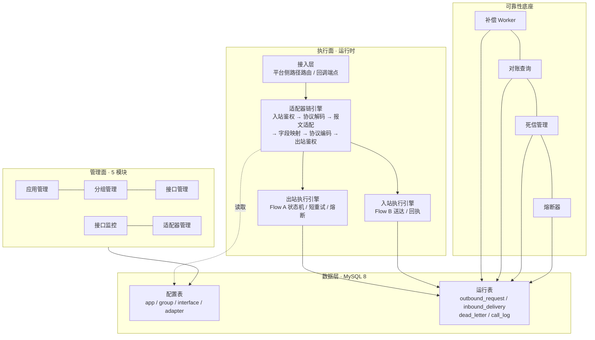

# API 中心 · 技术架构与实现方案

> 本文档依据《API中心设计方案.md》《API中心时序图与流程图.md》《API中心原型.html》整理，回答「怎么实现」。
> 设计语义以《API中心设计方案.md》为准；数据表细节见《表结构设计.html》；交付排期见《可行性报告.md》。
> 范围约定：只描述 API 中心自身（供应商侧建模），调用方鉴权 / 向回调地址签名属平台统一能力，不在本方案内。

## 1. 概述

### 1.1 定位

基础 API 中转 + 字段映射的统一调用平台：对外暴露统一接口，对内经适配器链完成鉴权、协议转换、报文适配、字段映射，转发至第三方供应商（上游），或将供应商回调送达调用方。**只做连接 + 适配 + 可靠传输，不承接业务决策。**

### 1.2 两条核心链路

| | 链路 | 路由 |
|---|---|---|
| Flow A 出站 | 调用方 → 平台接口 → 适配器链 → 供应商 → 反向适配 → 回调用方 | 出站中转接口 |
| Flow B 入站 | 供应商回调 → 平台接口 → 适配器链 → 送达回调地址 → ack 回执 | 入站回调接口 |

### 1.3 五大模块

应用管理、分组管理、接口管理、接口监控、适配器（对应原型五个页面）；状态机 / 错误码 / 容错机制为附录级横切能力。

## 2. 总体架构

### 2.1 分层架构



### 2.2 请求路径

- **Flow A（出站）**：调用方 → 接入层（路由到出站中转接口）→ 适配器链（协议解码→报文适配→字段映射→协议编码→出站鉴权=供应商签名）→ 调供应商 → 响应反向适配 → 统一信封回调用方。状态落 `outbound_request`。
- **Flow B（入站）**：供应商 → 回调端点（路由到入站回调接口）→ 入站鉴权（回调验签）→ 适配器链 → 送达回调地址 → 收到即回 ack 回执（与送达结果解耦）→ 送达失败转补偿。状态落 `inbound_delivery`。

### 2.3 架构原则

1. **配置与执行分离**：管理面只写配置（接口/适配器定义），执行面按配置解释执行，运行时零配置热加载。
2. **无状态适配器**：适配器实例无状态、配置驱动、链上复用；新增适配器不触碰既有链路。
3. **统一内部模型**：链内唯一数据载体，格式无关（JSON/XML 进出，内部一律树形中间表示）。
4. **表驱动状态机**：出站/入站两条状态机以 `status` 列为载体，worker 按 `(status, next_retry_at)` 扫描。

## 3. 技术选型

> 以下选型沿用既有代码基线的已验证技术（@HttpExchange / @Retryable / AOP / OpenTelemetry），并按新设计约束扩展；三个依据文档本身未指定语言/框架。

| 层次 | 建议选型 | 依据（对应设计文档） |
|---|---|---|
| 后端 | Java 21 + Spring Boot（最新稳定版，与既有代码基线保持一致） | §4.2 明确 Micrometer/Prometheus、§4.3 OpenTelemetry——JVM 生态集成最成熟；声明式 HTTP 接口适配「按配置调用供应商/送达回调地址」 |
| 协议编解码 | Jackson（JSON）+ Jackson XML / Woodstox | §5.4 协议适配器要求 JSON/XML 双格式、每应用独立实例、命名策略/日期格式/空值策略可配 |
| 声明式 HTTP 客户端 | Spring `@HttpExchange` + `HttpServiceProxyFactory`（通用接口 + 动态 URI / 凭证） | 出站调供应商、入站送达回调地址统一走声明式客户端；供应商地址 / 路径为运行时配置，客户端接口按协议维度定义、URI 与 Header 由适配器链运行时组装，不按渠道写死 |
| 短重试 | Spring `@Retryable`（`@EnableResilientMethods` 启用） | §6.1 5xx/429 指数退避短重试；重试耗尽交补偿 worker |
| AOP 日志 | Spring AOP + `@Aspect` | §4.1 调用日志统一拦截、traceId、脱敏 |
| 链路追踪 | OpenTelemetry（自动埋点 + 适配器节点手动 span） | §4.3 span 贯穿平台 → 上游，traceId 请求头透传 |
| 字段映射引擎 | 自研规则解释器（6 操作 + param）+ SpEL/Aviator 表达式内核 | §5.6 规则为接口级**运行时**配置（source/op/target/param/nullStrategy），必须解释执行；`condition` 操作需表达式求值 |
| 存储 | MySQL 8.0（生产）；演示可用嵌入式内存库 | 配置类低写高频读、运行类高频追加；事务保证状态机流转原子性 |
| 任务调度 | 调度框架（XXL-JOB 或 Spring Scheduler + 分布式锁） | §6.3 补偿 worker 按固定间隔扫描 COMPENSATING / PENDING 记录 |
| 前端管理面 | Vite + Vue 3（或维持原生单页） | 原型已用单文件 HTML/CSS/JS 定义全部交互与数据模型，工程化时平移 |

**关键选型说明一：动态字段映射不用编译期映射**。设计方案的映射规则由管理员在接口级动态配置（含枚举映射、条件、聚合等参数化操作），编译期代码生成无法消费运行时规则，必须采用**规则解释器**：解析 `fieldMappings[]` → 按 `op` 分发到 6 个执行器 → 结合 `param` 完成转换。

**关键选型说明二：MapStruct 不退出、职责收窄**。MapStruct 保留用于**编译期固定结构映射**：统一信封 `{code, msg, data}` 组装、配置实体 ↔ DTO 转换、内部模型与各运行记录的序列化。边界：`fieldMappings[]` 表驱动的归规则解释器；代码中固定不变的归 MapStruct。

## 4. 核心架构设计

### 4.1 统一内部模型

- 树形中间表示（字段无序映射 + 类型标注），是链内唯一数据载体。
- 进出边界：协议解码把来源报文解析为统一模型；协议编码把统一模型渲染为目标格式。
- 元数据随上下文传递：接口标识、应用标识（供应商）、输入/输出协议、traceId、鉴权结果、错误/告警收集。

### 4.2 适配器链执行引擎

- **契约**（对应 §5.2）：
  - `AdapterType type()`：鉴权 / 协议 / 报文三类；
  - `int order()`：链内顺序；
  - `boolean supports(AdapterContext ctx)`；
  - `AdapterContext process(AdapterContext ctx)`。
- **链上下文 AdapterContext**：统一内部模型 + 元数据 + 鉴权结果 + 错误/告警。
- **固定链顺序**：入站鉴权 → 协议解码 → 报文适配 → 字段映射（接口级规则）→ 协议编码 → 出站鉴权。
- **绑定解析**：接口 → `interface_adapter_binding`（角色：报文 / 供应商签名 / 回调验签；应用级默认 + 接口级覆盖）→ `adapter` 定义（含 params）→ 实例化。协议适配器由接口声明的入站 / 出站协议自动推导，不参与绑定；字段映射节点直接读取接口级 `fieldMappings[]`。
- **灰度**：按 `adapterType + impl + version` 索引适配器定义，接口绑定可指定版本，实现灰度切换。

### 4.3 鉴权双方向

| 方向 | 契约方法 | 本平台承担的场景 |
|---|---|---|
| 入站鉴权 | `authenticate(req)` | 仅**入站回调**：验供应商回调（HMAC 回调 / 云厂商回调验签），用应用「回调验签凭证」，独立于出站凭证 |
| 出站鉴权 | `applyCredential(out)` | **出站中转**：平台向供应商签名（API Key / HMAC / 云厂商签名 / OAuth2 / Bearer / Basic / mTLS / 无鉴权） |

- 调用方鉴权（平台自己的客户）与向回调地址签名：平台统一处理，不在接口模型内。
- 验签失败：401 拒绝 + 不落送达记录；连续失败告警 / 临时封禁。
- 凭证安全：出站凭证与回调验签凭证均加密存储（可逆加密或 KMS/HSM，不得单向哈希）、支持轮换（新旧并存）、泄漏即时失效。

### 4.4 动态字段映射引擎

- 规则结构（接口级）：`source`（入站字段，`default` 常量注入时可空）+ `op` + `target`（出站字段）+ `param`（参数化操作的值）+ `nullStrategy`。
- 六种操作的执行器：

| op | 语义 | param 示例 |
|---|---|---|
| rename | 字段重命名 | — |
| typeCast | 类型转换 | STRING / INT / DECIMAL / DATE / BOOL |
| enumMap | 枚举值映射 | `PENDING→0, DONE→1` |
| default | 常量注入（source 可空） | 默认值 |
| condition | 条件映射 | `amount > 0` |
| aggregate | 聚合 | CONCAT / SUM / MAX / MIN |

- 校验：`target` 必填；除 `default` 外 `source` 必填；参数化操作 `param` 必填（前端按 op 动态渲染参数输入）。
- 四种端到端转换（json-json / json-xml / xml-xml / xml-json）由「协议适配器 + 字段映射」协作完成，与映射引擎解耦。

### 4.5 出站执行引擎（Flow A）

状态机（载体 `outbound_request.status`）：

```
INIT → MAPPING → SENDING → RETRYING → COMPENSATING → SUCCESS / DEAD_LETTER / UNKNOWN
```

- 5xx/429 → 短重试：`@Retryable`（指数退避，未超上限回 SENDING）；重试耗尽 → COMPENSATING。实现要点：重试调用收敛在**独立 Invoker 类**（Spring AOP 自调用不触发代理，`@Retryable` 不能与调用方同 Bean）；**熔断闸门在 Invoker 调用前判断**——OPEN 时直接短路转补偿 / 死信，不触发短重试。
- 4xx（非 429）→ 死信（不重试）；超时/连接异常 → UNKNOWN → 对账收敛（SUCCESS 或 COMPENSATING）。
- 熔断闸门在 SENDING 前：OPEN 时不触发短重试，直接转补偿/死信；粒度「接口 + 供应商」。
- 补偿 worker 定时扫描 COMPENSATING 按间隔重试，超最大次数 → 死信 + 告警；**重放安全依赖上游对业务键幂等**（请求携带稳定 biz_id 由上游去重）。

### 4.6 入站执行引擎（Flow B）

状态机（载体 `inbound_delivery.delivery_status`）：

```
RECEIVED → ACKED（送达成功）/ PENDING（送达失败，仍回供应商 ack）
PENDING → ACKED（补偿重送成功）/ DEAD_LETTER（重送耗尽）
```

- ack 是**回执**：收到回调即回（固定 code/message），与送达结果解耦，不回传调用方 ack。
- 送达超时/重试复用接口级 `timeout_ms / max_retries` 语义（入站 = 回调地址调用）。
- 补偿 worker 扫描 PENDING 重送；重送耗尽 → 死信 + 告警。

### 4.7 可靠性底座与可观测

- **对账**：UNKNOWN 记录通过查询接口查上游真实状态（已成功→SUCCESS，未到达→触发补偿）。
- **死信**：4xx / 重试耗尽 / 补偿耗尽落 `dead_letter`（PENDING/HANDLED），支持人工查看与重放（重放=重新入队）。
- **熔断**：三态 CLOSED/OPEN/HALF_OPEN，参数：失败率阈值、滑动窗口 + 最小请求数、熔断时长、半开探测数。
- **日志**：Spring AOP（`@Aspect`）统一拦截 service / 适配器方法，记录请求/响应/耗时/traceId，敏感字段脱敏（手机号、密钥、Header 敏感值）；落 `call_log` 异步批量写。
- **指标**：Micrometer/Prometheus（调用量、成功率、P50/P95/P99，按接口、应用聚合）。
- **链路**：OpenTelemetry 自动埋点 + 适配器链每个节点手动 span（入站鉴权 / 协议解码 / 报文适配 / 字段映射 / 协议编码 / 出站鉴权）；traceId 以请求头透传「平台 → 上游 / 回调地址」，与 `outbound_request` / `inbound_delivery` 的 trace_id 关联。
- **告警**：成功率下降、延迟超限、死信堆积、补偿失败（阈值规则落 `alert_rule`）。

## 5. 模块实现方案

### 5.1 应用管理

- 表：`app`（+ 分组见 5.2）。
- 要点：
  - 凭证双列：`outbound_secret`（出站签名）、`callback_secret`（回调验签），加密存储、遮显展示、轮换与失效。
  - 生命周期状态机：草稿 → 启用 → 停用 → 注销；停用即拒绝其请求（网关层校验），注销后回收 appId。
  - IP 白/黑名单（逗号分隔，空=不限）在接入层校验。
  - 配额：QPS 限流、日调用量上限；超限拒绝 + 告警，不污染业务状态机。
  - 应用级默认：出站鉴权 + 回调验签 + 默认报文适配器；接口级可覆盖。

### 5.2 分组管理

- 表：`app_group`。纯归类/展示，不承载配置。
- 要点：应用 → 分组 → 接口层级；跨应用两级视图；接口在分组间移动 = 改 `interface.group_id`；新建接口两级下拉（先应用后分组）。

### 5.3 接口管理

- 表：`interface` + `interface_param` + `interface_body` + `interface_field_mapping` + `interface_field_def` + `interface_adapter_binding`。
- 要点：
  - 定义模型完整落库（类型/方法/路径/协议/目标地址/两侧参数/字段映射/响应·ack/鉴权/超时重试）。
  - 类型约束：出站 = 上游路径 + 供应商签名 + 出站响应字段；入站 = 回调地址 + 回调验签 + 出站侧送达报文（必填）+ ack 回执字段；两侧互斥字段按类型清空。
  - 版本化：配置变更生成新版本（`interface_snapshot`），支持回滚、灰度；下线后停止路由。
  - 校验：名称/路径/归属必填；目标地址必填；字段映射 target 必填、非 default 需 source、参数化操作需 param。

### 5.4 接口监控

- 表：`call_log`、`alert_rule`。
- 要点：日志异步落库（AOP）；traceId/orderId 维度快速定位；UNKNOWN 对账查询入口；死信查看与重放；指标按接口/应用维度聚合。

### 5.5 适配器

- 表：`adapter`（元数据：adapterType/impl/enabled/version/params）。
- 要点：
  - 三类：鉴权（auth）、协议（protocol）、报文（message）；字段映射为接口级配置，不作为适配器类型。
  - 参数元数据驱动表单（原型 ADAPTER_FIELDS 模式）：每个 impl 声明字段 schema，管理面据此渲染。
  - 鉴权 impl 注册表（10 种）与协议 impl（JSON/XML）与报文 impl（信封/报文头）；新增实现即插即用。
  - 启用/停用、版本化、灰度切换。

## 6. 安全设计

- 凭证：出站/回调两类凭证加密存储、界面遮显、日志脱敏、轮换与即时失效。
- 验签：时间戳容差、防重放、连续失败告警 / 临时封禁；云厂商回调验签独立规范（事件通知 / SNS / 回调签名）。
- 传输：HTTPS；Basic Auth 仅限 HTTPS；mTLS 用于双向证书场景。
- 补充建议：入站接口的「回调地址」为平台发起的送达目标，需做 URL 校验与内网地址限制，防 SSRF。

## 7. 实施路线图

| 里程碑 | 范围 | 出口标准 |
|---|---|---|
| M1 骨架 | 管理面框架 + app/app_group/interface 表与 CRUD + 应用生命周期 + 分组 | 应用/分组/接口配置闭环 |
| M2 出站链路 | 适配器注册表 + 链引擎 + 协议编解码（JSON）+ 字段映射全操作 + 出站状态机/短重试/补偿/死信 | json-json 出站链路端到端跑通 |
| M3 协议与入站 | XML 编解码 + 入站回调链路（回调验签/送达/回执/补偿）+ 出站响应字段/ack 字段 | json-xml、入站回调端到端 |
| M4 容错与监控 | 熔断、UNKNOWN 对账、死信重放、调用日志/指标/链路/告警 | 可靠性底座与可观测齐备 |
| M5 版本与灰度 | 接口版本化、适配器版本灰度、压测与调优 | 支持回滚与灰度发布 |

## 8. 关键决策记录（ADR 摘要）

1. **字段映射采用运行时规则解释器，而非编译期映射**——规则为接口级动态配置（6 操作 + param），编译期方案无法消费。
2. **适配器无状态 + 配置驱动**——链上复用、热插拔、版本化灰度。
3. **鉴权双方向分离**——出站签名（供应商凭证）与回调验签（回调凭证）独立建模；调用方相关平台统一，范围外。
4. **ack = 回执，与送达解耦**——收到即回、失败转补偿，不引入「调用方 ack → 供应商 ack」反向映射。
5. **不设平台侧幂等开关**——去重依赖上游对业务键幂等（补偿重放安全的必要条件）。
6. **状态机表驱动**——以 status 列 + `(status, next_retry_at)` 索引支撑补偿/对账 worker 扫描。
7. **复用既有技术基线**——声明式 HTTP 客户端（`@HttpExchange`）、短重试（`@Retryable` + 独立 Invoker 类）、AOP 日志、OpenTelemetry 沿用既有实现经验；MapStruct 保留于固定结构映射（动态映射走规则解释器）。
