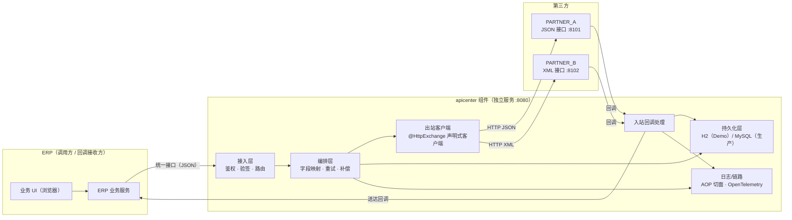
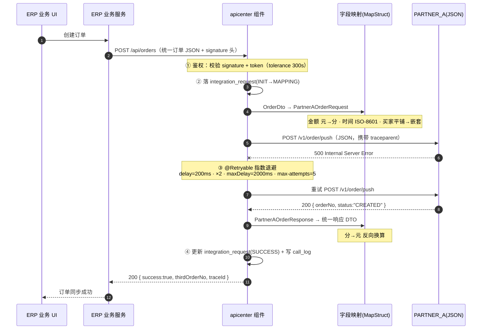
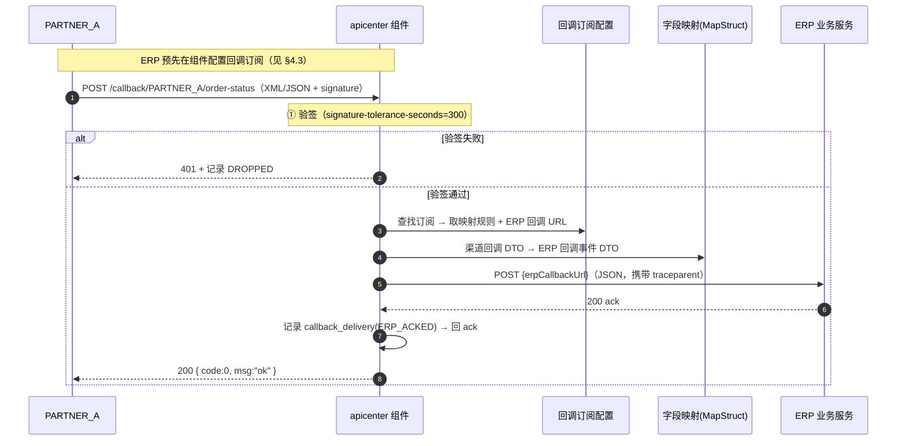
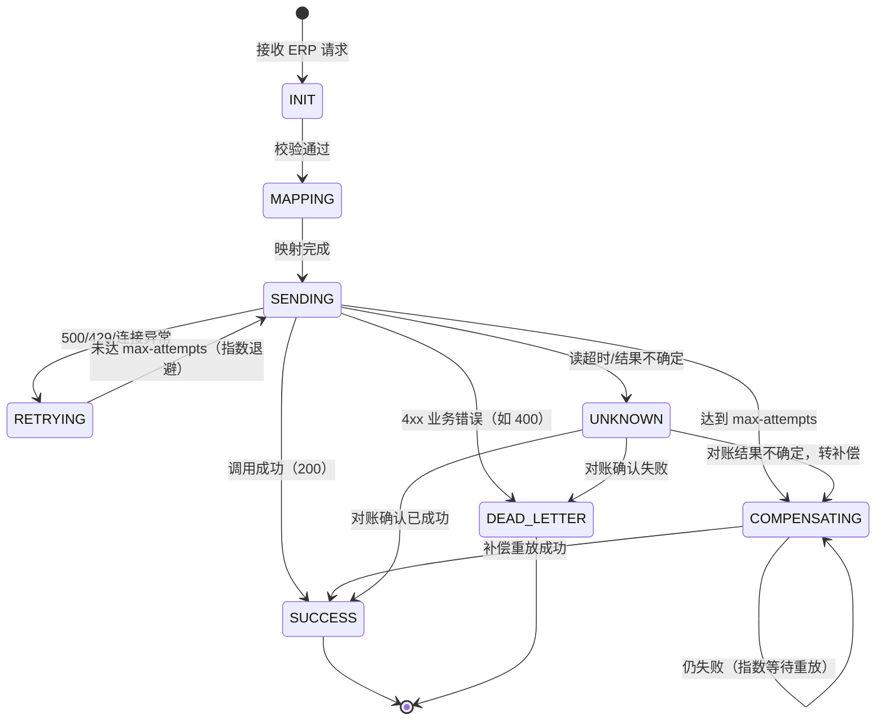
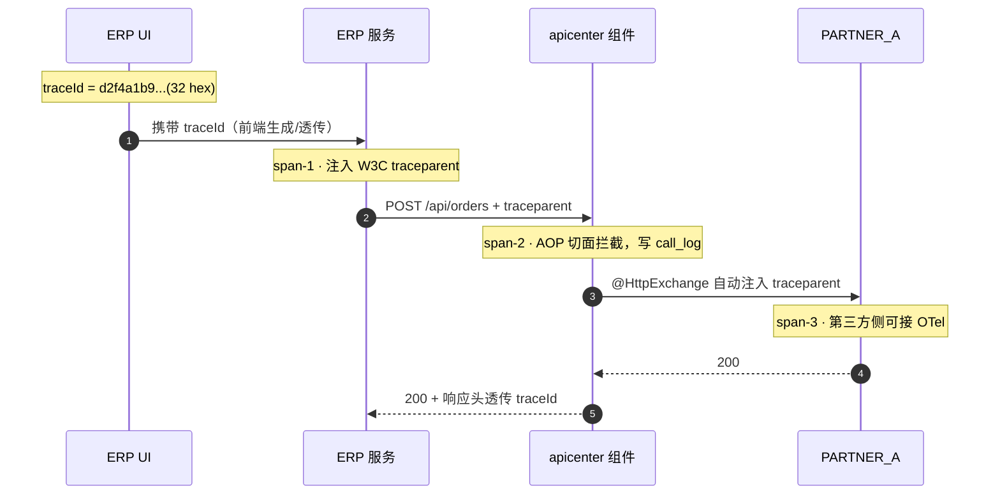
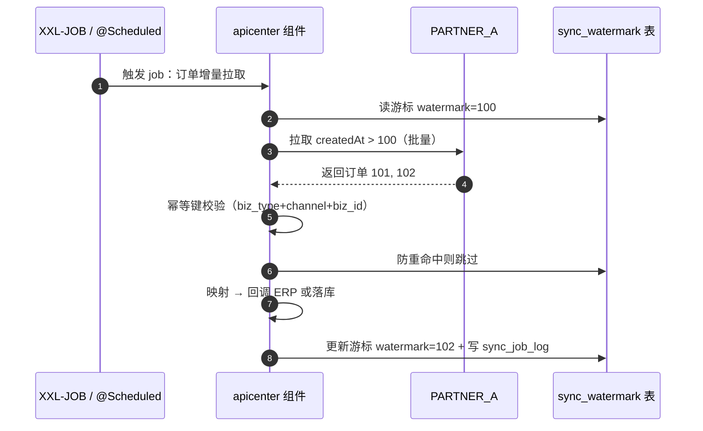
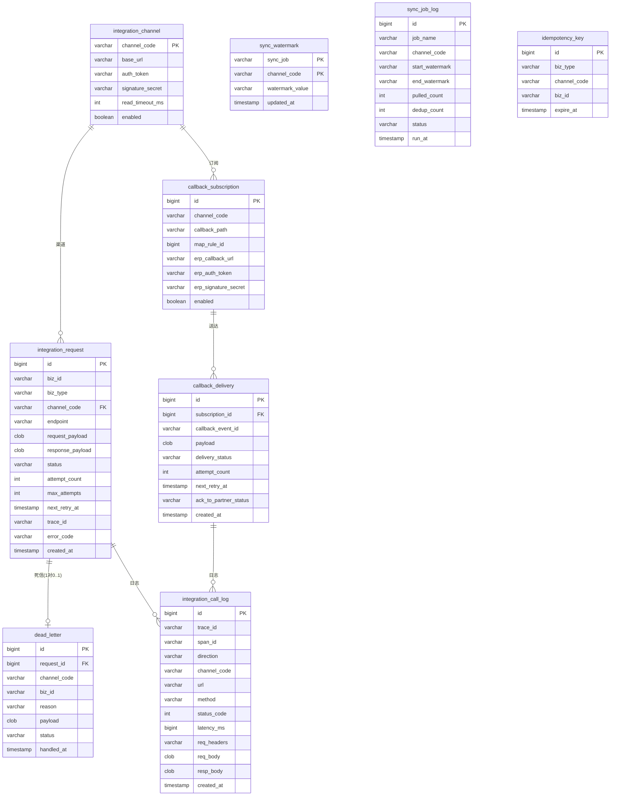

# API 三方接口统一调用平台组件 · 设计文档

> 逻辑上是 ERP 的「小组件」，物理上是**独立 Spring Boot 服务、独立库表、独立发布**；
> 只做 **连接 + 适配 + 可靠传输**，不承接 ERP 业务决策。
>
> Demo 页面：[在线演示](../api演示 demo.html) ｜ 索引：[README](../../../../README.md)

---

## 目录

1. [概述与定位](#1-概述与定位)
2. [总体架构](#2-总体架构)
3. [Flow A 出站链路（ERP → 组件 → 第三方）](#3-flow-a-出站链路erp--组件--第三方)
4. [Flow B 入站回调链路（第三方 → 组件 → ERP）](#4-flow-b-入站回调链路第三方--组件--erp)
5. [字段映射设计](#5-字段映射设计)
6. [重试与补偿](#6-重试与补偿)
7. [日志与链路追踪](#7-日志与链路追踪)
8. [定时/实时同步](#8-定时实时同步)
9. [数据模型](#9-数据模型)
10. [API 清单](#10-api-清单)
11. [四大能力演示（验收）](#11-四大能力演示验收)
12. [附录](#12-附录)

---

## 1. 概述与定位

### 1.1 一句话定位

**apicenter** 是 ERP 连接第三方系统的「连接器」：对外向 ERP 暴露统一、稳定的调用面，对内做字段适配、失败重试、可靠传输、全链路可观测；它**不解释业务**，任何「要不要同步、怎么处理业务异常」的决策都交还 ERP。

### 1.2 范围边界

| 做（连接 + 适配 + 可靠传输） | 不做（ERP 业务决策） |
|---|---|
| 统一接入面（鉴权 / 验签 / 路由） | 业务规则判断（优惠、风控、库存策略等） |
| 字段映射（MapStruct / Jackson，JSON 与 XML 双格式） | 业务状态流转决策 |
| 失败重试 + 持久化补偿 + 死信 | 数据对账口径制定（只提供机制与对账入口） |
| 请求日志 + traceId 全链路追踪 + 敏感信息脱敏 | 第三方接口的业务语义理解 |
| 定时增量拉取 + 防重 |  |
| 渠道配置、回调订阅配置 |  |

### 1.3 非目标（本期 Demo）

- 不实现生产级分布式锁（Demo 用内存防重，设计预留生产切换点）
- 不接入真实 XXL-JOB 调度中心（Demo 用 `@Scheduled` 模拟，设计说明 XXL-JOB 接入方式）
- 不使用 MySQL（生产目标库，Demo 用 H2 内存库，DDL 兼容 InnoDB）

### 1.4 读者对象

- ERP 团队：了解如何调用组件、如何配置第三方回调订阅
- 平台开发：了解模块划分、状态机、表结构、扩展点
- 测试/运维：了解链路、日志、配置项

---

## 2. 总体架构

### 2.1 系统组件图



### 2.2 分层职责

| 层 | 职责 | 关键实现 |
|---|---|---|
| 接入层 | ERP 调用鉴权（signature+token）、第三方回调验签、路由到正确处理器 | `SignatureFilter` / `@ControllerAdvice` |
| 编排层 | 加载映射规则 → MapStruct 字段映射 → 调用 → 失败处理（重试/补偿/死信/对账） | `OrderSyncService` + `RetryPolicy` |
| 出站客户端 | 声明式 HTTP 调用第三方，自动注入鉴权头与 traceparent | `@HttpExchange` 接口 + `RestClient` |
| 入站回调处理 | 验签 → 映射 → 送达 ERP → 回 ack 第三方 | `CallbackController` + `CallbackDeliveryService` |
| 持久化层 | 请求记录（outbox）、调用日志、死信、订阅、游标 | Spring JDBC + `schema.sql` |
| 日志/链路 | AOP 统一拦截、traceId 传播、敏感头脱敏 | `@Aspect` + Micrometer Tracing |

### 2.3 技术选型

| 组件 | 版本 | 用途 | 当前骨架状态 |
|---|---|---|---|
| Java / Spring Boot | 21 LTS / 4.1.x | 基线 | ✅ 已配置 |
| Spring Framework | 7.0.x | `@HttpExchange`、内置 `@Retryable`（`@EnableResilientMethods`） | ✅ 主类已启用 |
| JSON | Jackson 3（`tools.jackson.*`，注解 `com.fasterxml.jackson.annotation`） | DTO 序列化 + 字段注解 | ✅ |
| **XML** | `jackson-dataformat-xml` | PARTNER_B XML 格式序列化 | ⚠️ **后续实现需新增依赖** |
| 数据库 | H2（内存，Demo）；MySQL 8.0.19+/InnoDB（生产，暂缓） | 持久化 | ✅ H2 已配置 |
| 映射 | MapStruct 1.6.3 | DTO ↔ 领域对象编译期转换 | ✅ 注解处理器已配置 |
| 日志/链路 | spring-boot-starter-opentelemetry + micrometer-prometheus | traceId 全链路 + 指标 | ✅ 已配置（导出关闭） |
| 重试 | Spring Resilience（`@Retryable`） | 短重试（指数退避） | ✅ |
| 定时 | `@Scheduled`（Demo）；XXL-JOB（生产接入方案见 §8） | 增量拉取 | ✅ `@EnableScheduling` |
| 测试 | WireMock 3.9.1 | 模拟 PARTNER_A/B/ERP | 版本已占位 |

### 2.4 规划包结构（后续实现）

```
com.deepx.apicenter
├── ApicenterApplication.java
├── controller/     # 对 ERP 统一接口、第三方回调端点
├── client/         # @HttpExchange 声明式客户端（PartnerAClient / PartnerBClient / ErpCallbackClient）
├── mapper/         # MapStruct 映射器（OrderMapper）
├── dto/            # 统一 DTO + 渠道侧 DTO（含 Jackson 注解）
├── entity/         # 表实体
├── repo/           # JDBC 仓储
├── service/        # 编排、补偿、对账、同步
├── aspect/         # AOP 日志切面
├── config/         # 渠道配置、RestClient 构建、签名工具
└── worker/         # 补偿 worker、增量拉取 job
```

---

## 3. Flow A 出站链路（ERP → 组件 → 第三方）

### 3.1 时序图



### 3.2 出站处理流程（7 步）

| 步骤 | 说明 | 演示点 |
|---|---|---|
| 1 | ERP 调用统一接口 `POST /api/orders`，请求头携带 `X-Signature`、`X-App-Id`、`X-Timestamp` | 敏感头脱敏演示（§7） |
| 2 | 组件校验签名与 token，失败返回 `401` | 鉴权 |
| 3 | MapStruct 将统一 `OrderDto` 映射为渠道侧 DTO（JSON/XML 两套） | 字段映射（§5） |
| 4 | `@HttpExchange` 调用第三方 | 声明式客户端 |
| 5 | 处理响应：成功 → 反向映射；失败 → 进入重试/补偿/死信/对账分支（§6） | 失败重试（§6） |
| 6 | 反向映射为 ERP 统一响应格式 | 字段映射（§5） |
| 7 | 返回 ERP，更新状态机，记录日志 | traceId 全链路（§7） |

### 3.3 失败分支总览

| 第三方响应 | 组件处理 | 终态 |
|---|---|---|
| `500` / `429` / 连接异常 | `@Retryable` 指数退避短重试（未达 `max-attempts`） | 重试成功 → SUCCESS |
| 重试达到上限 | 状态置 `COMPENSATING`，补偿 worker 按 `retry-worker-fixed-delay-ms` 周期重放（内存实现，生产换分布式锁） | 补偿成功 → SUCCESS |
| `400`（业务错误） | 不重试，直接落死信表 `dead_letter` | DEAD_LETTER |
| 读超时（`read-timeout-ms=3000`）/ 结果不确定 | 状态置 `UNKNOWN`，触发对账（调第三方查询接口 reconcile） | 对账后 SUCCESS / DEAD_LETTER / COMPENSATING |

---

## 4. Flow B 入站回调链路（第三方 → 组件 → ERP）

### 4.1 时序图



### 4.2 入站处理流程（5 步）

| 步骤 | 说明 | 演示点 |
|---|---|---|
| 1 | 第三方回调组件端点 `POST /callback/{channel}/order-status` | 验签 |
| 2 | 组件验签（HMAC-SHA256），失败 → `DROPPED` | 验签失败分支 |
| 3 | 查订阅配置，MapStruct 映射为 ERP 回调事件 | 字段映射（§5） |
| 4 | 送达 ERP 回调 URL，等待 ack | 可靠送达 |
| 5 | 记录送达状态，回第三方 `200 ack`；送达失败 → `callback_delivery(PENDING)` 由补偿 worker 重发 | 补偿（§6） |

### 4.3 回调订阅配置（ERP 侧操作）

ERP 在组件上登记「第三方接口 → 组件回调端点 → ERP 回调 URL」的映射，例如：

| 配置项 | 示例值 |
|---|---|
| channelCode | `PARTNER_A` |
| callbackPath | `/callback/PARTNER_A/order-status` |
| 触发方式 | 第三方主动回调（Webhook） |
| erpCallbackUrl | `http://localhost:8103/api/erp/order-status` |
| erpAuthToken | `erp-token` |
| erpSignatureSecret | `erp-secret` |

> 配置落表 `callback_subscription`，Demo 页 Tab「Flow B」直观展示配置 → 回调 → 送达的完整闭环。

---

## 5. 字段映射设计

### 5.1 统一订单模型（组件内部唯一业务对象）

```java
public record OrderDto(
    String orderId,            // ERP 订单号
    String orderType,          // 业务类型：PUSH / PULL
    String orderStatus,        // 状态：NEW / PAID / SHIPPED
    BigDecimal totalAmount,    // 总金额（元，scale=2）
    String currency,           // 币种：CNY
    String buyerName,          // 买家姓名
    String buyerPhone,         // 买家手机
    LocalDateTime createdTime, // 创建时间
    List<OrderItemDto> items,  // 明细（skuCode / qty / unitPrice / amount）
    AddressDto shippingAddress,// 收货地址（province / city / detail）
    String remark              // 备注
) {}
```

### 5.2 映射差异表（ERP ⇄ PARTNER_A JSON ⇄ PARTNER_B XML）

| 语义 | ERP 字段 | PARTNER_A JSON 键 | PARTNER_B XML 键 | 转换规则 |
|---|---|---|---|---|
| 订单号 | `orderId` | `orderNo` | `OrderNo` | 命名差异（camel ↔ Pascal） |
| 业务类型 | `orderType` | `orderType` | `OrderType` | 直传 |
| 状态 | `orderStatus` | `orderStatus` | `Status` | 命名差异 + **值映射**（`NEW→1, PAID→2, SHIPPED→3`） |
| 总金额 | `totalAmount`（元） | `totalAmountCent`（分） | `TotalAmount`（分） | **元 ×100 → 分**（BigDecimal → long） |
| 币种 | `currency` | `currency` | `Currency` | 直传 |
| 买家 | `buyerName` + `buyerPhone` | `buyer.name` + `buyer.mobile` | `<Buyer><Name>` + `<Buyer><Phone>` | 平铺 → 嵌套聚合 |
| 创建时间 | `createdTime` | `createdAt` `2026-08-17T10:30:00` | `CreatedTime` `20260817103000` | **时间格式差异**（ISO-8601 vs `yyyyMMddHHmmss`） |
| 明细 | `items[]` | `items[]`（skuCode/quantity/unitPriceCent/amountCent） | `<Item>` 平铺（无外层包裹） | 嵌套列表；金额同 ×100 |
| 收货地址 | `shippingAddress` | `receiver`（province/city/detail） | `<Receiver>` | 字段重命名 + 嵌套 |
| 备注 | `remark` | `note` | `Remark` | 命名差异 |

> Demo 页 Tab「字段映射」以可视化方式呈现本表，并并排渲染实际 JSON 与 XML 样例。

### 5.3 Jackson 注解表达

- **PARTNER_A JSON DTO** `PartnerAOrderRequest`：字段级 `@JsonProperty("orderNo")`（或类级 `@JsonNaming` 策略），保证 JSON 键名确定；金额字段用 `long totalAmountCent`。
- **PARTNER_B XML DTO** `PartnerBOrderRequest`：依赖 `jackson-dataformat-xml`；类级 `@JacksonXmlRootElement(localName = "OrderPushRequest")`；字段级 `@JacksonXmlProperty(localName = "OrderNo")`；明细列表加 `@JacksonXmlElementWrapper(useWrapping = false)` 去掉外层 `<Items>`，让 `<Item>` 平铺为根子元素。

### 5.4 MapStruct 表达（核心示例）

```java
@Mapper(componentModel = "spring")
public interface OrderMapper {

    // ERP 统一订单 → PARTNER_A JSON
    @Mapping(source = "totalAmount", target = "totalAmountCent", qualifiedByName = "yuanToCent")
    @Mapping(source = "createdTime", target = "createdAt", dateFormat = "yyyy-MM-dd'T'HH:mm:ssXXX")
    @Mapping(source = "buyerName", target = "buyer.name")
    @Mapping(source = "buyerPhone", target = "buyer.mobile")
    @Mapping(source = "shippingAddress", target = "receiver")
    @Mapping(source = "remark", target = "note")
    PartnerAOrderRequest toPartnerA(OrderDto dto);

    // ERP 统一订单 → PARTNER_B XML
    @Mapping(source = "totalAmount", target = "totalAmount", qualifiedByName = "yuanToCent")
    @Mapping(source = "createdTime", target = "createdTime", dateFormat = "yyyyMMddHHmmss")
    @Mapping(source = "buyerName", target = "buyer.name")
    @Mapping(source = "buyerPhone", target = "buyer.phone")
    @Mapping(source = "shippingAddress", target = "receiver")
    PartnerBOrderRequest toPartnerB(OrderDto dto);

    // PARTNER_A 响应 → 统一响应
    @Mapping(source = "totalAmountCent", target = "totalAmount", qualifiedByName = "centToYuan")
    ErpOrderResponse toErpResponse(PartnerAResponse resp);

    @Named("yuanToCent")
    default long yuanToCent(BigDecimal yuan) {
        return yuan.multiply(BigDecimal.valueOf(100)).longValue();
    }

    @Named("centToYuan")
    default BigDecimal centToYuan(long cent) {
        return BigDecimal.valueOf(cent, 2);
    }
}
```

### 5.5 映射要点

| 差异类型 | 处理手段 |
|---|---|
| 命名差异（camel ↔ Pascal / 缩写） | `@JsonProperty` / `@JacksonXmlProperty` / `@Mapping` |
| 值差异（状态枚举） | MapStruct `@ValueMapping` 或 `@Mapping` + `@Named` 转换方法 |
| 金额单位（元 ↔ 分） | `@Named` 默认方法 `yuanToCent` / `centToYuan` |
| 时间格式 | `@Mapping(dateFormat = ...)` |
| 平铺 → 嵌套聚合（买家、地址） | 嵌套目标类型自动递归映射 |
| 列表（明细） | 嵌套列表递归自动映射 |

---

## 6. 重试与补偿

### 6.1 出站状态机



### 6.2 入站送达状态机（Flow B 简化）

```
RECEIVED → VERIFIED → DELIVERING → ERP_ACKED → CALLBACK_ACKED
DELIVERING → RETRYING（送达失败）→ DELIVERING（重发）
VERIFIED → DROPPED（验签失败）
```

### 6.3 `@Retryable` 短重试参数

```java
@Retryable(
    includes = { HttpServerErrorException.class, TooManyRequests.class, ResourceAccessException.class },
    maxRetries = 4,                       // max-attempts=5 → 首次 + 4 次重试
    delay = 200, multiplier = 2, maxDelay = 2000, timeUnit = TimeUnit.MILLISECONDS)
// 读超时 read-timeout-ms=3000 落入 RestClient，抛 ResourceAccessException → 进 UNKNOWN 分支
// 注：Spring 7 原生 resilience（org.springframework.resilience.annotation）为扁平参数，
//     无 spring-retry 风格的 retryFor/backoff=@Backoff；maxRetries 为重试次数（非总尝试数）
```

### 6.4 补偿 worker

- 扫描 `integration_request` 中 `status = COMPENSATING`（及入站 `callback_delivery` 中 `PENDING`）的记录，按 `next_retry_at` 到期重放
- `@Scheduled(fixedDelayString = "${app.integration.retry-worker-fixed-delay-ms}")`，周期 3000ms
- Demo 为**内存实现**；生产切分布式锁 + 分区扫描（预留扩展点）

### 6.5 死信与对账

- 400 等 4xx 业务错误 → 写 `dead_letter`（含 reason + 原始 payload），人工/管理端点处理
- 超时 → `UNKNOWN` → 调第三方查询接口 reconcile：确认已成功 → SUCCESS；确认失败 → DEAD_LETTER；仍不确定 → COMPENSATING

---

## 7. 日志与链路追踪

### 7.1 traceId 全链路串联（UI → ERP → 组件 → 第三方）



- 传播协议：**W3C `traceparent`**（`00-<traceId>-<spanId>-<flags>`）
- `@HttpExchange` 底层 `RestClient` 自动注入 traceparent，无需手写
- 全程 traceId 不变，spanId 逐跳变化；Demo 页以同一色系贯穿展示

### 7.2 AOP 统一拦截

- 切面拦截 `service` 包内标注 `@LoggedCall` 的方法，记录：入参 / 出参 / 耗时 / 异常
- 出站与入站统一写 `integration_call_log`

### 7.3 敏感头脱敏

| 头/字段 | 脱敏规则 |
|---|---|
| `Authorization` | `Bearer ****` |
| `auth-token` | `****` |
| `signature-secret` | `****` |
| 请求体中的 `cardNo` / `idCardNo` | 保留后 4 位，前段 `****` |

### 7.4 日志字段规范（JSON 行）

```
{traceId, spanId, direction: OUT|IN, channel: PARTNER_A, url, method, statusCode,
 latencyMs, reqHeaders(脱敏), reqBody, respBody, timestamp}
```

> Demo 页底部黑色日志控制台即按此规范渲染。

---

## 8. 定时/实时同步

### 8.1 增量拉取时序（高水位游标）



### 8.2 防重

- 同窗口防重：`idempotency_key` 表唯一键 `(biz_type, channel_code, biz_id)`，重复写入跳过
- 生产：分布式锁（如 Redis SETNX）包住整个拉取窗口，防止多实例并发拉重
- 兜底：`@CircuitBreaker` 保护第三方拉取，失败转入补偿

### 8.3 XXL-JOB 接入方式（生产）

- 执行器模式：组件作为 XXL-JOB 执行器，`@XxlJob("orderIncrementalPull")` 方法即为拉取入口
- Demo 用 `@Scheduled(fixedDelayString = ...)` 模拟同一方法体，便于本地演示

---

## 9. 数据模型

### 9.1 ER 图



### 9.2 核心表清单

| 表 | 关键列 | 用途 / 关联 |
|---|---|---|
| `integration_channel` | channel_code PK、base_url、auth_token、signature_secret、read_timeout_ms、enabled | 渠道配置，对齐 `application.yaml` 的 `app.integration.channels` |
| `integration_request` | status、attempt_count、next_retry_at、trace_id | 出站请求主记录（outbox），`status` 即 §6 状态机载体 |
| `integration_call_log` | trace_id、span_id、direction、req_headers(脱敏后) | AOP 写入，日志可查 |
| `dead_letter` | request_id、reason、status | 400 死信 |
| `callback_subscription` | channel_code、callback_path、erp_callback_url、erp_signature_secret | Flow B 入站渠道配置 |
| `callback_delivery` | subscription_id、delivery_status、attempt_count、ack_to_partner_status | 送达/补偿记录 |
| `sync_watermark` | sync_job、channel_code、watermark_value | 高水位游标 |
| `sync_job_log` | pulled_count、dedup_count、status | 定时拉取执行审计 |
| `idempotency_key` | (biz_type, channel_code, biz_id) 唯一 | 同窗口防重 |

### 9.3 DDL 草案（H2，兼容 MySQL InnoDB）

```sql
CREATE TABLE IF NOT EXISTS integration_request (
    id              BIGINT AUTO_INCREMENT PRIMARY KEY,
    biz_id          VARCHAR(64)   NOT NULL,
    biz_type        VARCHAR(32)   NOT NULL,
    channel_code    VARCHAR(32)   NOT NULL,
    endpoint        VARCHAR(255)  NOT NULL,
    request_payload CLOB,
    response_payload CLOB,
    status          VARCHAR(32)   NOT NULL,
    attempt_count   INT           NOT NULL DEFAULT 0,
    max_attempts    INT           NOT NULL DEFAULT 5,
    next_retry_at   TIMESTAMP,
    trace_id        VARCHAR(32),
    error_code      VARCHAR(32),
    created_at      TIMESTAMP     NOT NULL DEFAULT CURRENT_TIMESTAMP
);
-- 其余表同风格，见 Demo 页「状态机与数据模型」Tab 简表
```

---

## 10. API 清单

### 10.1 组件对 ERP（出站统一接口）

| 方法 | 路径 | 说明 |
|---|---|---|
| POST | `/api/orders` | 推送订单（Flow A 主入口），Header：`X-App-Id` / `X-Timestamp` / `X-Signature` |
| POST | `/api/orders/query` | 订单状态对账查询（UNKNOWN 对账入口） |
| GET | `/api/integration/requests/{id}` | 查询出站请求状态机（管理） |
| GET | `/api/integration/dead-letters` | 死信列表（管理） |

### 10.2 第三方回调组件（Flow B 入站端点）

| 方法 | 路径 | 说明 |
|---|---|---|
| POST | `/callback/{channel}/order-status` | 第三方订单状态回调（验签 + 映射 + 送达 ERP） |
| POST | `/callback/{channel}/order-push-result` | 第三方推送结果回执（可选） |

### 10.3 ERP 配置组件（管理端点）

| 方法 | 路径 | 说明 |
|---|---|---|
| POST | `/api/subscriptions` | 登记第三方回调订阅（Flow B 配置入口） |
| PUT | `/api/subscriptions/{id}` | 更新订阅 |

---

## 11. 四大能力演示（验收）

| 能力 | 设计章节 | Demo 页位置 | 演示动线 |
|---|---|---|---|
| 3.1 字段映射 | §5 | Tab「字段映射」+ Flow A 步骤③/⑥ | 同一订单对象映射为 PARTNER_A JSON / PARTNER_B XML；三列对照表 hover 联动；金额 元→分、时间格式、嵌套聚合高亮 |
| 3.2 失败重试 | §6 | Tab「Flow A」场景切换下拉 | 纯成功 200（绿）；500→指数退避重试→200（绿）；重试耗尽→补偿重放→成功（紫）；429 路径；400→死信（红）；超时→UNKNOWN→对账（灰） |
| 3.3 请求日志 | §7 | 顶部 traceId 栏 + 底部日志控制台 | 一次调用 traceId 从 UI 到第三方全程不变；敏感头 `****`；日志按 span 着色 |
| 3.4 定时/实时同步 | §8 | Tab「定时增量拉取」 | 高水位游标 100→102 动画；拉取列表 + 同窗口防重标记（dedup） |

---

## 12. 附录

### 12.1 配置项总表（对齐 `../application.yaml`）

| 配置 | 值 | 说明 |
|---|---|---|
| `spring.datasource.url` | `jdbc:h2:mem:apicenter;DB_CLOSE_DELAY=-1` | H2 内存库 |
| `server.port` | `8080` | 组件服务端口 |
| `app.integration.max-attempts` | `5` | `@Retryable` 最大尝试次数 |
| `app.integration.retry-worker-fixed-delay-ms` | `3000` | 补偿 worker 扫描周期 |
| `app.integration.signature-tolerance-seconds` | `300` | 签名时间戳容差 |
| `app.integration.channels.PARTNER_A.base-url` | `http://localhost:8101` | PARTNER_A（JSON） |
| `app.integration.channels.PARTNER_B.base-url` | `http://localhost:8102` | PARTNER_B（XML） |
| `app.integration.channels.ERP.base-url` | `http://localhost:8103` | ERP 回调接收端 |
| `*.read-timeout-ms` | `3000` | 各渠道读超时，超时进 UNKNOWN |

### 12.2 测试方案（后续实现）

- WireMock 3.9.1（版本已占位）分别 mock `PARTNER_A`(:8101)、`PARTNER_B`(:8102)、`ERP`(:8103)
- 场景用例：
  - PARTNER_A 首次返回 500、重试后 200 → 断言短重试生效、状态 SUCCESS
  - PARTNER_A 恒 500 → 断言转 COMPENSATING、补偿 worker 重放
  - PARTNER_A 返回 400 → 断言进 dead_letter
  - PARTNER_A 超时 → 断言 UNKNOWN → 对账恢复
  - 回调验签失败 → DROPPED；ERP 不可用 → 送达补偿重发

### 12.3 敏感数据说明

- 本 Demo 仅 H2 内存库、本地端口；生产须将 `auth_token` / `signature_secret` 移入配置中心/KMS，库表存储加密
- 日志持久化需清理规则（按 traceId 保留窗口），避免敏感请求体长期留存
